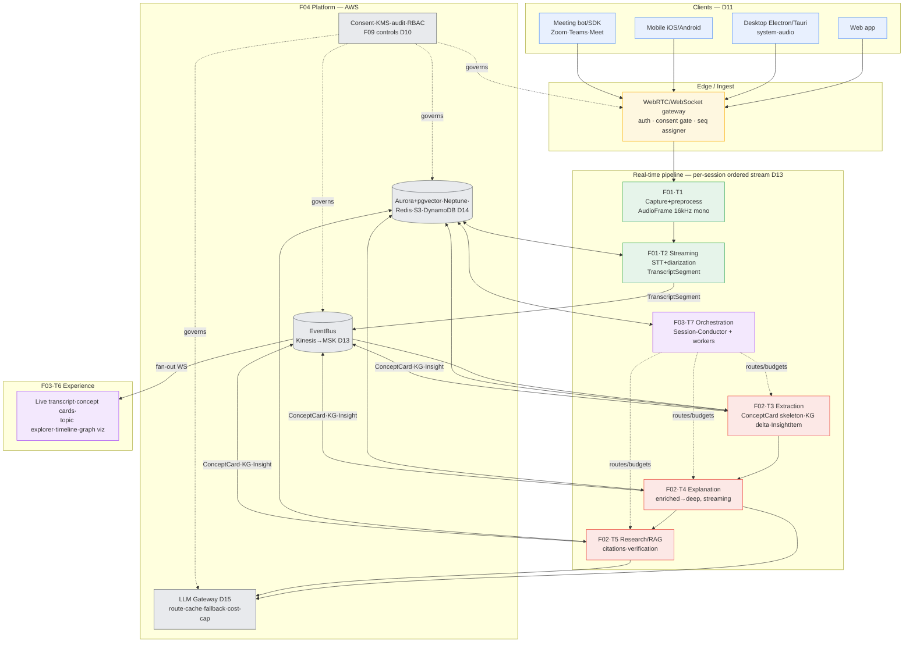

# Integration · Unified Architecture

The single reconciled architecture for **Aizen** — a real-time conversation
intelligence platform that transcribes, explains, and teaches any live
conversation. This unifies all ten teams (five lanes) under the shared
conventions in `DECISIONS.md` (D01–D16).

## 1. System at a glance

## 2. The end-to-end flow (one utterance)

| Step | Owner | Artifact | Latency budget (D07) |
|---|---|---|---|
| 1. Capture + preprocess (HPF/NS/AGC/VAD), batch ~100 ms | F01·T1 | `AudioFrame` (16 kHz mono PCM) | capture+stream ≤ 500 ms |
| 2. Streaming STT + online diarization | F01·T2 | `TranscriptSegment` partial→final | STT partial ≤ 800 ms |
| 3. Adapter maps F01→F02 fields (D16), extract on `is_final` | F02·T3 | `ConceptCard` skeleton, `kg_delta`, `InsightItem` | extraction ≤ 700 ms |
| 4. Explain (Sonnet) streaming first token | F02·T4 | `ConceptCard` → `enriched` | explanation first-token ≤ 1000 ms |
| 5. Render skeleton chip → hydrate card | F03·T6 | UI update | render ≤ 300 ms |
| 6. Deep dive (Opus + RAG + citations + NLI verify) | F02·T4/T5 | `ConceptCard` → `deep` | best-effort ≤ 10 s |

**Total speech→first-useful-UI: p50 ≤ 3 s, p95 ≤ 5 s** (D07), achieved via
streaming at every stage, speculative prefetch on partials, and prompt caching.

> **⚠ Superseded by D17 / doc 12 (2026-06-01).** This per-stage table does not
> sum to 3 s (500+800+700+1000+300 = 3300 ms) and omits the EventBus hops (×2),
> provider RTT, and prompt-cache miss. It also chains off the 800 ms *partial*
> while step 3 commits to extracting on *finals* (~2.0 s). The rebuilt budget —
> with p50+p95 columns that sum, explicit bus/RTT/cache lines, and a binding
> **speculative-on-stabilized-partial** trigger (D17) keyed to when the word is
> *spoken* (not utterance-end) — is in `12-latency-budget.md`. The live-caption
> path holds; the concept-card path is what the rebuild fixes.

## 3. Layer ownership (who owns what, no overlap)

| Layer | Lane / teams | Responsibility |
|---|---|---|
| Clients & capture | F01·T1 | Mic, desktop system-audio, mobile, meeting bot/SDK; preprocessing; streaming protocol (WebRTC hot path, WS fallback). |
| Transcription | F01·T2 | Streaming STT, diarization, confidence, domain biasing, language. Owns `AudioFrame`/`TranscriptSegment`. |
| Understanding | F02·T3 | Topic/concept/acronym/entity/relationship extraction, segmentation, semantic index, knowledge-graph build. Owns `ConceptCard`/`KG*`/`InsightItem`. |
| Teaching | F02·T4 | Explanations, jargon-simplification, examples/analogies, assumptions/hidden-context, grounding/anti-hallucination. |
| Evidence | F02·T5 | RAG, web + internal search, citation model, fact verification, source ranking. |
| Experience | F03·T6 | All UI surfaces, workflows, accessibility, multi-platform. Renders F01/F02 contracts by name. |
| Orchestration | F03·T7 | Session-Conductor + stateless workers, memory, routing, verification/eval agents, failure recovery. |
| Platform | F04·T8 | AWS infra, EventBus (D13), datastores (D14), LLM gateway (D15), observability, cost, multi-region, DR. |
| Trust | F04·T9 | Consent loop, encryption/KMS, retention, GDPR/CCPA/HIPAA, enterprise controls, audit, threat model. |
| Business | F05·T10 | Personas, market, competition, pricing, MVP scope, roadmap, GTM. |

## 4. Control loops that cross lanes

- **Consent loop (C-8):** F03 UX captures consent → F04 gate authorizes the
  session → F01 stamps `consent.mode`/`consent_id` on every `AudioFrame` and
  `TranscriptSegment` → F02 honors `consent_class`/`pii_present` (INV-6: no
  external retrieval for sensitive/PII) → F04 enforces retention + `no_audio_retention`.
- **Cost/quality loop (C-5/C-9):** F03·T7 orchestration picks a model tier per
  task (D04) → F04 LLM gateway (D15) enforces per-tenant/per-tier minute caps,
  Free→Haiku-only routing, prompt caching, provider fallback, and cost-ceiling
  cutoffs → F05 pricing tiers gate what the gateway allows.
- **Graph-sync loop (C-7):** F02 emits ordered `kg_delta` → F03 applies in order,
  requests resync on gap → F04 serves replay/snapshot from the per-session log.
- **Grounding loop:** F02·T5 verifies each claim (NLI, trust tiers T1–T4) →
  `grounding.verification_state` rides the `ConceptCard` → F03 visibly marks
  unverified/contested claims; refuted claims are redacted from UI.

## 5. Canonical data contracts (the integration glue)

| Contract | Owner | Consumers | Seam doc |
|---|---|---|---|
| `AudioFrame` | F01 | F01·T2 | F01 data-contracts §2 |
| `TranscriptSegment` | F01 | F02 (via adapter D16), F03 | F01 data-contracts §3 |
| `ConceptCard` | F02 | F03 | F02 data-contracts §2 |
| `KnowledgeGraphNode/Edge` + `kg_delta` | F02 | F03 | F02 data-contracts §3–4 |
| `InsightItem` | F02 | F03 | F02 data-contracts §5 |

All carry the D06 envelope (`tenant_id`, `session_id`, `seq`, monotonic
timestamps). Ordering/idempotency: per-session ordered stream (D13), dedup on
`(id, revision)` / `(segment_id, rev)`, higher revision supersedes.

> **⚠ Refined by doc 10 / INV-8 (2026-06-01).** "Higher revision supersedes" is
> necessary but not sufficient: the F01→F02 adapter must pass `rev`/`supersedes`
> through (it originally dropped them), supersede/correction must propagate to
> re-extract or **retract** citing artifacts (new `ConceptCard` `retracted`
> state), and `kg_delta` resync needs the `kg_snapshot`/`kg_resync_request`
> schemas + a `delta_seq`↔bus-`Position` index. Field-level contracts in
> `10-seam-contracts.md`. Note also the per-class `seq` counters are independent
> (not one global watermark) — gap detection is per message class.

## 6. Cross-cutting principles

- **Server-authoritative, thin clients** (D11): clients render and capture; all
  AI and state live server-side.
- **Streaming-first**: every stage emits incremental results; nothing waits for
  completion to show value.
- **Privacy by default** (D10): `no_audio_retention` is the default; voiceprints
  off; sensitive/PII sessions never leave to external retrieval.
- **Tiered intelligence** (D04): Haiku routes/classifies/extracts, Sonnet runs
  the hot explanation path, Opus does deep dives, open-weight models cover
  self-host/enterprise and cost control.
- **One event backbone** (D13): the per-session ordered log is the spine; every
  lane is a producer/consumer on it, never a point-to-point caller.
