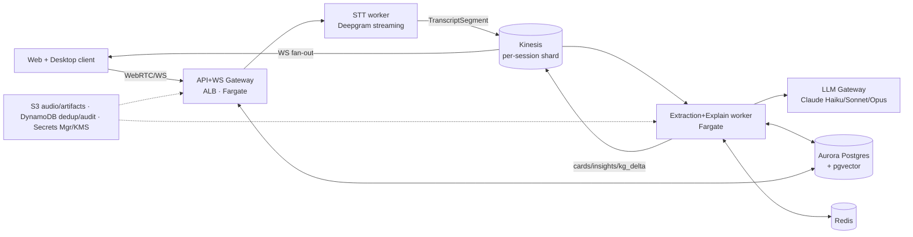

# Integration · MVP Architecture

The smallest system that delivers the wedge — **real-time transcribe + explain +
teach** for individual knowledge workers — scoped to the F05 MVP feature set
(C-10) and the D02 MVP target (**1,000 MAU, ~200 concurrent sessions**).

## 1. MVP scope (in / out)

| In (MVP) | Out (deferred → doc 04 / roadmap) |
|---|---|
| Web app + desktop app (system-audio capture) | Mobile apps |
| **One** meeting-join path (Zoom bot first) | Teams / Meet / Webex joins |
| Streaming STT + online diarization (hosted) | Self-hosted STT fleet |
| Concept extraction + knowledge graph (data model) | Full graph **visualization** (data only at MVP; basic view) |
| Explain-and-teach (skeleton→enriched→deep) | Multi-language (English-first) |
| Insights (action items / decisions / open questions) | — |
| **Lite** Research/RAG (web + citations, top-1) | n-best lattice, large internal-doc KB |
| Consent capture + `no_audio_retention` + encryption | HIPAA BAA path, SSO/SCIM |
| Single region (us-east-1), multi-AZ | Multi-region / data residency |
| Free + Pro tiers (Stripe) | Team / Enterprise tiers |

## 2. MVP topology (deliberately boring)

**Key MVP simplifications (all are documented "grow-up" points):**
- **Kinesis** (not MSK) for the event log — cheaper, managed, fine at 200
  concurrent (D13 says MSK comes at Year-1).
- **Aurora + pgvector** does triple duty: relational, vector (embeddings), and
  **graph-as-adjacency-tables** — no Neptune yet (D14/D09).
- **Hosted STT (Deepgram)** — no GPU fleet to operate; pure opex.
- **Fargate** for all compute — no EKS/Karpenter, no GPU ops.
- Orchestration is the F03·T7 **Session-Conductor** running as a Fargate task per
  active session, with stateless extraction/explanation workers behind it.

## 3. How the lanes show up at MVP

| Lane | MVP deliverable | MVP cut |
|---|---|---|
| F01 | Web+desktop capture, preprocessing, Deepgram streaming STT, online diarization, `TranscriptSegment` | Mobile, Teams/Meet, self-host STT, offline diarization refine |
| F02 | Adapter (D16), extraction → skeleton cards + insights + `kg_delta`, Sonnet explanations, lite web RAG with citations + basic NLI grounding | Large internal KB, n-best, advanced verification, deep historical context optional |
| F03 | Live transcript view, concept cards (collapsed/expanded), basic timeline, simple list-style "topics"; Session-Conductor + workers; WCAG 2.2 AA core | Graph viz canvas, topic-explorer graph, mobile UX, eval-agent sampling |
| F04 | Single-region AWS (Fargate, Kinesis, Aurora+pgvector, Redis, S3, DynamoDB), LLM gateway, consent gate, KMS, audit log, CloudWatch+OTel | Multi-region, Neptune, MSK, SOC 2 cert (in progress), HIPAA, SSO |
| F05 | Free (300 min, Haiku-only) + Pro ($20, bounded hours + overage), Stripe, PLG meeting-bot loop | Team/Enterprise, sales motion |

## 4. MVP latency reality

The full D07 budget is met with hosted components: Deepgram partials ~300 ms,
Haiku extraction ~680 ms p95, Sonnet first token ~700 ms → **p50 ~2.5 s,
p95 ~4.5 s** speech→enriched card. Deep dives stream over ≤10 s. No part of the
MVP needs GPUs or multi-region to hit the budget.

## 5. MVP cost posture (ties to RISK-1 / C-9)

At ~$2.00/session-hour (F04 MVP cost model, dominated by STT minutes + LLM
tokens), MVP runs at **thin-to-negative contribution margin by design** — this is
a funded land-grab phase. Controls already in the MVP:
- Free hard-capped at 300 min/mo, **Haiku-only** routing (LLM gateway, D15).
- Pro gets a **bounded** monthly hour pool + usage-based overage (not unlimited).
- Prompt caching + tiered routing + extracting on finals only (not partials).
Margin target (65%+) is a **Year-1-scale** goal (doc 04), not an MVP goal.

## 6. MVP exit criteria (what "done" looks like)

1. A user joins/records a 30-min conversation and sees accurate speaker-labeled
   transcript + ≥1 useful concept card within p95 ≤ 5 s.
2. Insights (action items/decisions/questions) extracted with ≥1 transcript
   citation each (INV-4).
3. Consent captured per session; `no_audio_retention` honored end-to-end.
4. Free→Pro upgrade flow works through Stripe; per-tier caps enforced at the gateway.
5. 10–15 design partners (MAN, High) validate the wedge and pricing.
