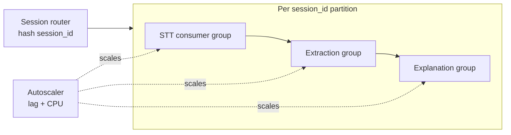

# Integration · Scaling Architecture

How Aizen grows from MVP (1k MAU / 200 concurrent) to **Year-1 (100k MAU / 5k
concurrent)** and **North-star (2M MAU / 50k concurrent)** — D02. Each row is a
component's MVP form and its grow-up trigger.

## 1. The scaling ladder

| Component | MVP | Year-1 | North-star | Trigger to advance |
|---|---|---|---|---|
| Event backbone (D13) | Kinesis | **MSK (Kafka)** behind `EventBus` | MSK multi-cluster, per-region | >~1k concurrent or shard-mgmt pain |
| Compute hot path | Fargate | Fargate + autoscale | Fargate + capacity reservations | CPU-bound queueing |
| STT (D05) | Hosted (Deepgram) | Hosted + **self-host Whisper/Parakeet on EKS+Karpenter GPU** for cost | Self-host primary, hosted burst/overflow | STT spend > self-host TCO (~Year-1) |
| LLM (D04) | Hosted Claude tiers | Hosted + prompt-cache + **open-weight on GPU** for cheap tiers | Mixed hosted/self-host by tier + region | Token spend + latency SLOs |
| Vector (D14) | pgvector in Aurora | **OpenSearch / Pinecone** | Sharded vector cluster, per-region | Index > ~5–10M vectors or recall latency |
| Graph (D14) | Postgres adjacency | **Amazon Neptune** | Neptune + read replicas, partition by tenant | Graph queries dominate / multi-hop |
| Relational | Aurora single-writer | Aurora + read replicas | Aurora Global + sharding by tenant | Write IOPS / connection ceiling |
| Cache | Redis (single) | Redis cluster | Redis cluster per region | Memory / throughput |
| Region | us-east-1 multi-AZ | + us-west-2 (DR) | + eu-central-1 (residency), active-active | DR maturity / EU customers |
| LLM gateway (D15) | Single service | HA + per-tenant rate-limit | Per-region gateway, cost-aware routing | QPS / cost-control needs |

## 2. Scaling the real-time pipeline

The spine is the **per-session ordered stream** (D13). Scaling = scaling
partitions and stateless consumers:

- **Partition by `session_id`** → ordering preserved per conversation while total
  throughput scales horizontally with partitions/shards.
- **Consumer groups** are stateless and autoscale on **stream lag** (the true
  backpressure signal) plus CPU.
- **Session-Conductor (F03·T7)** is one lightweight task per active session;
  50k concurrent = 50k conductors, sharded across the Fargate fleet, each cheap
  because heavy lifting is delegated to shared worker pools + the LLM gateway.

## 3. Cost trajectory (F04 model, ties to RISK-1)

| Scale | Cost / session-hour | Primary lever pulled |
|---|---|---|
| MVP | ~$2.00 | (none — all hosted) |
| Year-1 | ~$0.98 | Self-host STT on GPU; prompt caching; reserved capacity |
| North-star | ~$0.47 | Self-host cheap LLM tiers; volume contracts; per-region efficiency |

This curve is what turns the MVP's thin/negative margin into F05's **75%+** gross
margin at scale — the unit economics are a function of scale, so growth and
margin are the same project.

## 4. Reliability & DR at scale (F04·T8)

- **MVP:** multi-AZ, automated Aurora backups, S3 versioning. RPO ≤ 5 min /
  RTO ≤ 1 h for the control plane; live sessions are best-effort (a dropped
  session reconnects and replays from the stream).
- **Year-1:** warm DR in us-west-2; stream + datastore replication; tiered
  RPO/RTO (transactional ≤ 1 min / ≤ 30 min; analytics relaxed).
- **North-star:** active-active multi-region; per-region data residency (EU);
  graceful regional failover with session re-pinning.

## 5. What unlocks at each stage (feature × scale)

| Capability | Stage | Why gated |
|---|---|---|
| Mobile apps | Year-1 | After web/desktop wedge proven; app-store + capture work |
| Knowledge-graph visualization | Year-1 | Needs Neptune-class graph + canvas UX investment |
| Teams / Meet / Webex joins | Year-1 | Per-platform integration + partner approvals |
| Multi-language | Year-1→North-star | STT + explanation model coverage + eval |
| SSO / SCIM / RBAC, Enterprise tier | Year-1 (sales motion) | Requires SOC 2 + enterprise controls (F04·T9) |
| HIPAA / regulated verticals | North-star | BAA chain, PHI handling, audit maturity |
| Tenant-global speaker identity | North-star | BIPA/biometric consent + privacy review (C-4) |

## 6. Scaling risks (carried into doc 07)

- STT/LLM **vendor concentration** — mitigated by the gateway's provider
  abstraction + planned self-host.
- **Stream hot-partitions** — a very long single session; mitigation: sub-keying
  + consumer parallelism within a session for non-order-critical work.
- **Graph blow-up** for long sessions — mitigation: salience-based pruning +
  recency-decayed edge weights (F02 already models `weight`/decay).
