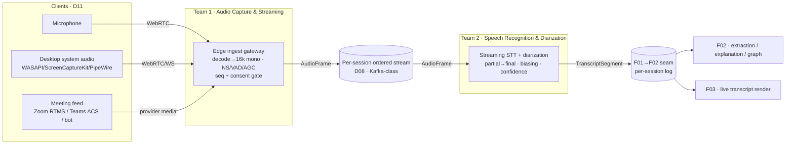

# 01 — Capture & Transcription Pipeline (Lane F01)

> **Aizen** — "AI explains the room." This lane is the **head of the pipeline**:
> live audio in → speaker-attributed, confidence-scored **`TranscriptSegment`**
> out. Everything downstream (F02 understanding/explanation, F03 rendering)
> consumes the transcript this lane produces.

## What this lane owns

| Doc | Scope |
|---|---|
| [`team-01-audio-capture-streaming.md`](./team-01-audio-capture-streaming.md) | **Team 1** — mic / desktop system-audio / mobile capture; Zoom·Teams·Meet integration; preprocessing, denoise, VAD; streaming protocol (WebRTC/WS/gRPC); edge ingest → `AudioFrame`. |
| [`team-02-speech-recognition-diarization.md`](./team-02-speech-recognition-diarization.md) | **Team 2** — streaming STT (hosted vs self-hosted); diarization; biasing/jargon; confidence; language detection; WER/DER + RTF/latency targets → `TranscriptSegment`. |
| [`data-contracts.md`](./data-contracts.md) | **AUTHORITATIVE** `AudioFrame` + `TranscriptSegment` schemas (D06). The F01→F02 seam. |

This lane does **not** own: post-transcript understanding/explanation/RAG (F02),
UI rendering (F03), cloud infra / event-backbone provisioning / DR (F04).

## End-to-end pipeline

## How the two teams fit together

1. **Team 1** captures from any surface, normalizes to one canonical audio
   format, applies VAD/denoise, and emits an ordered **`AudioFrame`** stream
   (16 kHz mono, `seq`-stamped, consent-gated) onto the D08 backbone.
2. **Team 2** consumes `AudioFrame`s, runs streaming ASR + diarization,
   stabilizes partials into finals, scores confidence, tags domain terms, and
   emits the authoritative **`TranscriptSegment`** stream.
3. The handoff between them is the `AudioFrame` contract; the handoff **out of
   the lane** (to F02/F03) is the `TranscriptSegment` contract.

## Latency budget (D07) — this lane's slice

| D07 budget item | Owner | Target | Where covered |
|---|---|---|---|
| capture + stream ≤ 500 ms | Team 1 | ~130 ms p50 / ~320 ms p95 | team-01 §2.1 |
| STT partial ≤ 800 ms | Team 2 | ~260–330 ms p50 / ~590–770 ms p95 | team-02 §6.1 |

Both fit inside the D07 split, leaving headroom for TURN relay (Team 1) and
single-channel diarization (Team 2). Downstream budget (extraction ≤ 700 ms,
explanation first-token ≤ 1,000 ms, render ≤ 300 ms) belongs to F02/F03.

## Scale model (D02) — at a glance

| Tier | Concurrent sessions | Audio streams | Capture compute | STT decode streams |
|---|---|---|---|---|
| MVP | 200 | ~280 | 1–2 SFU + 2–3 ingest | hosted |
| Year-1 | 5,000 | ~7,000 | ~16 SFU + ~50 ingest | hosted + burst |
| North-star | 50,000 | ~70,000 | ~150 SFU + ~470 ingest | hybrid self-host |

Details + cost in team-01 §6–7 and team-02 §8–9.

## Key decisions (lane summary)

- **Edge transport:** WebRTC (SFU) primary, WebSocket fallback, gRPC internal.
- **System audio:** desktop-first (web can't; mobile constrained).
- **Meeting MVP:** Zoom RTMS (labeled) + universal desktop system-audio; Teams/Meet later.
- **STT MVP:** hosted Deepgram Nova-3 behind an `SttEngine` abstraction; hybrid
  self-host (Parakeet/Whisper) from Year-1 for cost/privacy.
- **Diarization:** per-track (preferred) + single-channel online + offline refine.

## Integration seam for F02 (read this, F02)

- The atomic unit is **`TranscriptSegment`** (data-contracts.md §3). It carries
  the D06 required fields (`session_id`, `tenant_id`, `seq`, monotonic
  timestamps) plus speaker, confidence/band, language, word timings, and
  pre-tagged `domain_terms[]`.
- **Act on finals** (`is_final=true`); treat partials as best-effort. Handle
  **revisions** (`rev`) and **supersedes** (late corrections). Delivery is
  at-least-once, per-session ordered — dedup on (`segment_id`,`rev`).
- F02 owns `ConceptCard`/`KnowledgeGraph*`/`InsightItem`; F01 hands you
  pre-tagged domain spans to bootstrap extraction but does not define those
  contracts.

## Cross-references

- Shared conventions: `DECISIONS.md` (D01–D12).
- Event backbone (D08) + datastores (D09): authoritative word is **F04**.
- Consent/privacy model (D10): authoritative word is **F09**; this lane emits
  consent touchpoints on every `AudioFrame`/`TranscriptSegment`.
- Client surface coordination (D11): **F03/F06** UX + this lane's capture clients.

## Manual tasks raised by this lane

See `features/F01-capture-transcription/MANUAL.md` (IDs `MAN-F01-001`…) and the
global `NEEDS_USER.md`. Summary: meeting-platform developer/partner accounts
(Zoom/Teams/Meet), STT vendor accounts + keys + DPA/BAA, app-store + system-audio
entitlements/signing.
