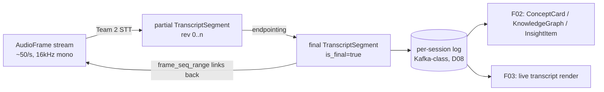

# F01 Data Contracts — `AudioFrame` & `TranscriptSegment` (AUTHORITATIVE)

> **Status:** Authoritative. F01 owns these schemas per DECISIONS.md **D06**.
> All other lanes (F02–F05) reference them **by name only** and MUST NOT
> redefine them. `TranscriptSegment` is the **integration seam between F01 and
> F02** — it is the atomic unit that flows downstream into knowledge extraction,
> explanation, and rendering.
>
> Versioning: every contract carries `schema_version` (semver). Breaking changes
> bump major and are announced in `RESULT.md` integration notes. F02+ pin a
> minimum compatible version.

This document is the single source of truth for the two contracts F01 produces:

| Contract | Producer | Primary consumer | Transport | Cardinality |
|---|---|---|---|---|
| `AudioFrame` | Team 1 (Audio Capture & Streaming) | Team 2 (STT) | Edge→ingest (WebRTC/WS), then internal stream | ~50/s per session (20 ms frames) |
| `TranscriptSegment` | Team 2 (Speech Recognition & Diarization) | F02 (extraction/explanation), F03 (render) | Per-session ordered log (D08, Kafka-class) + WS fan-out | ~1–4 finals/s + partials per session |

---

## 1. Conventions shared by all messages (D06)

Every inter-service message in the pipeline carries the following envelope fields
(D06 mandates `session_id`, `tenant_id`, `seq`, and monotonic timestamps):

| Field | Type | Required | Notes |
|---|---|---|---|
| `schema_version` | string (semver) | yes | e.g. `"1.0.0"`. |
| `tenant_id` | string (UUID) | yes | Multi-tenant isolation key (D06). Partition/ACL boundary. |
| `session_id` | string (UUID) | yes | One live conversation. Stream partition key (D08). |
| `seq` | uint64 | yes | Monotonic per `session_id`, gap-free, starts at 0. Dedup + ordering. |
| `producer_id` | string | yes | Logical producer instance (e.g. `capture-edge-7`, `stt-worker-3`). |
| `emitted_at` | int64 (µs, Unix epoch UTC) | yes | When the producer emitted the message (monotonic per producer). |

**Timestamp model (critical, read carefully).** Two clock domains exist and MUST
NOT be conflated:

- **Media time** (`*_ms` offsets): milliseconds from `session_start`, derived
  from the audio sample clock. Drift-free relative to the media itself; used for
  alignment, seeking, and joining frames↔segments. **Authoritative for ordering
  of audio content.**
- **Wall-clock time** (`emitted_at`, `*_at`): µs Unix epoch, for latency
  measurement and observability only. Subject to NTP skew; never used to order
  media.

All offsets are **integers**, never floats, to avoid accumulation error.

---

## 2. `AudioFrame`

A timestamped chunk of captured PCM audio plus session/speaker/source metadata.
This is the **internal** representation after edge ingest; the raw bytes on the
wire (WebRTC Opus, etc.) are decoded to canonical PCM at the ingest gateway
before an `AudioFrame` exists.

### 2.1 Canonical audio format (post-ingest normalization)

| Property | MVP value | Rationale |
|---|---|---|
| Sample rate | 16 kHz | Sufficient for speech; matches most STT models' native rate; ~half the bytes of 48 kHz. |
| Bit depth | 16-bit signed PCM (S16LE) | Lossless for ASR; simple. |
| Channels | mono (1) | Per-participant streams kept separate (see `channel_role`); mixing only for archival. |
| Frame duration | 20 ms (320 samples = 640 bytes) | Matches Opus/WebRTC packetization; balances latency vs overhead. |
| Endianness | little-endian | x86/ARM default. |

> Raw 48 kHz stereo is captured at the edge for **archival** (Blob, D09) when
> consent allows (D10); the ASR path consumes the normalized 16 kHz mono stream.

### 2.2 Schema

```jsonc
{
  // --- envelope (section 1) ---
  "schema_version": "1.0.0",
  "tenant_id": "0f6c…",
  "session_id": "9a21…",
  "seq": 12840,                  // monotonic per session across ALL AudioFrames
  "producer_id": "capture-edge-7",
  "emitted_at": 1748707200123456,

  // --- timing (media clock) ---
  "start_ms": 257000,           // media offset of first sample in this frame
  "duration_ms": 20,            // nominal 20 ms
  "session_start_at": 1748706943000000, // wall-clock anchor for media time

  // --- audio payload ---
  "codec": "pcm_s16le",         // canonical post-ingest; enum below
  "sample_rate_hz": 16000,
  "channels": 1,
  "samples": 320,               // per channel
  "payload": "<base64 | ref>",  // see payload modes below
  "payload_ref": null,          // Blob/obj-store URI when payload offloaded

  // --- source & routing meta ---
  "source": {
    "kind": "mic",              // enum: mic | system_audio | meeting_bot | meeting_sdk | virtual_device | upload
    "platform": "desktop",      // enum: web | desktop | mobile_ios | mobile_android | server
    "meeting_provider": null,   // enum|null: zoom | teams | meet | webex | generic_sip
    "device_label": "MacBook Pro Microphone",
    "channel_role": "local_participant", // enum: local_participant | remote_mix | remote_participant | loopback_system
    "participant_hint": "p_03"  // platform-provided participant id when available (e.g. Zoom user id); else null
  },

  // --- quality / preprocessing flags ---
  "audio_meta": {
    "rms_dbfs": -28.4,          // loudness, for AGC/observability
    "is_speech": true,          // VAD verdict for this frame (may be null if VAD deferred to STT)
    "vad_prob": 0.93,           // 0..1 speech probability, null if not computed
    "preprocessing": ["hpf", "ns", "agc"], // applied chain: hpf|ns|agc|aec|none
    "clipping": false,
    "snr_db_est": 18.2          // estimated SNR, null if unknown
  },

  // --- consent / privacy (D10) ---
  "consent": {
    "mode": "store_audio",      // enum: store_audio | no_audio_retention | transcript_only
    "consent_id": "c_88…",      // ref to consent record (F09 owns store)
    "redaction_pending": false
  }
}
```

### 2.3 Payload modes

| Mode | When | `payload` | `payload_ref` |
|---|---|---|---|
| Inline | Hot path, real-time STT | base64 PCM (≤ a few KB/frame) | null |
| Batched-inline | Internal stream efficiency | N frames coalesced (e.g. 100 ms) | null |
| Offloaded | Archival / large reprocessing | null | `https://aizenaudio.blob.core.windows.net/{tenant}/{session}/{seq_range}.pcm` |

> On the **real-time hot path** frames are batched to ~100 ms (5×20 ms) before
> hitting the internal stream to cut per-message overhead while staying inside
> the capture+stream ≤ 500 ms budget (D07). 20 ms remains the *capture* and
> *VAD* granularity.

### 2.4 Enums

- `codec`: `pcm_s16le` (canonical), `opus` (wire only, pre-normalization),
  `flac` (archival).
- `source.kind`: `mic | system_audio | meeting_bot | meeting_sdk |
  virtual_device | upload`.
- `consent.mode`: `store_audio | no_audio_retention | transcript_only` (D10).

### 2.5 Invariants

1. `seq` is gap-free and monotonic per `session_id`; the ingest gateway is the
   sole `seq` assigner for `AudioFrame`.
2. `start_ms` of frame *n+1* = `start_ms` of *n* + `duration_ms` of *n*
   (within one `channel_role` stream); discontinuities (mute, packet loss)
   emit a `gap` marker frame (`samples: 0`, `audio_meta.is_speech: false`,
   `duration_ms` = gap length).
3. When `consent.mode != store_audio`, `payload_ref` MUST be null and inline
   `payload` MUST be dropped after STT consumes it (no audio at rest).

---

## 3. `TranscriptSegment` — the F01→F02 seam

A speaker-attributed, timestamped, confidence-scored span of recognized text.
**This is the atomic unit flowing downstream.** F02 keys all extraction,
explanation, and graph-building off it; F03 renders it. Treat its shape as a
stable public API.

### 3.1 Lifecycle: partial → final

A segment is emitted multiple times as recognition firms up:

```
 t →
 [partial seq=101 "so the qua…"        is_final=false rev=0]
 [partial seq=101 "so the quarterly ar…"is_final=false rev=1]
 [partial seq=101 "so the quarterly ARR" is_final=false rev=2]
 [FINAL   seq=101 "So the quarterly ARR." is_final=true  rev=3]   ← immutable after this
```

Consumers MUST handle **revisions**: a `segment_id` may be re-emitted with a
higher `rev` and corrected text/timing until `is_final=true`. After final, the
`segment_id` is immutable except for an explicit `correction` supersede (3.4).

### 3.2 Schema

```jsonc
{
  // --- envelope (section 1) ---
  "schema_version": "1.0.0",
  "tenant_id": "0f6c…",
  "session_id": "9a21…",
  "seq": 101,                   // monotonic per session across ALL TranscriptSegments
  "producer_id": "stt-worker-3",
  "emitted_at": 1748707201987000,

  // --- identity & lifecycle ---
  "segment_id": "9a21…:seg:101",// stable across revisions; {session}:seg:{seq}
  "rev": 3,                     // revision counter; increments on partial updates
  "is_final": true,             // true = immutable (subject to 3.4 supersede)
  "supersedes": null,           // segment_id this correction replaces (3.4), else null

  // --- timing (media clock) ---
  "start_ms": 256480,
  "end_ms": 258120,
  "session_start_at": 1748706943000000,

  // --- recognized content ---
  "text": "So the quarterly ARR.",
  "language": "en-US",          // BCP-47; detected or configured (Team 2)
  "language_confidence": 0.99,  // 0..1, null if not detected
  "words": [                    // word-level alignment; present on finals, best-effort on partials
    {
      "w": "So",
      "start_ms": 256480, "end_ms": 256610,
      "confidence": 0.98,
      "speaker_id": "spk_2",
      "is_domain_term": false,
      "alt": null               // top alternative token when low-confidence, else null
    },
    {
      "w": "ARR",
      "start_ms": 257900, "end_ms": 258120,
      "confidence": 0.71,
      "speaker_id": "spk_2",
      "is_domain_term": true,    // matched a biasing/custom-vocab entry
      "alt": "AR"
    }
  ],

  // --- confidence (D05, Team 2) ---
  "confidence": 0.91,           // 0..1 segment-level aggregate (see Team 2 §scoring)
  "confidence_band": "high",    // enum: high(≥0.85) | medium(0.6–0.85) | low(<0.6)
  "no_speech_prob": 0.01,

  // --- diarization / speaker ID (Team 2) ---
  "speaker": {
    "speaker_id": "spk_2",      // diarization-local label, stable within session
    "speaker_confidence": 0.88, // 0..1
    "participant_id": "p_03",   // resolved platform/identity id when known, else null
    "display_name": "Speaker 2",// UI label; may be renamed by user later (F03)
    "channel_role": "remote_participant",
    "is_overlap": false,        // overlapping speech detected
    "diarization_method": "online_clustering" // see Team 2
  },

  // --- domain / biasing trace (Team 2) ---
  "domain_terms": [             // domain terms recognized in this segment
    { "term": "ARR", "canonical": "Annual Recurring Revenue", "source": "tenant_glossary", "char_start": 17, "char_end": 20 }
  ],

  // --- partial/final latency telemetry (D07 observability) ---
  "timing_meta": {
    "first_partial_at": 1748707201100000,
    "final_at": 1748707201987000,
    "audio_end_to_partial_ms": 620,   // must fit STT partial ≤ 800 ms (D07)
    "audio_end_to_final_ms": 1900,
    "rtf": 0.31                       // real-time factor for the producing worker
  },

  // --- provenance & correction ---
  "stt_engine": "deepgram-nova-3",    // or self-hosted: whisper-large-v3-turbo, parakeet-...
  "model_version": "nova-3-2026.02",
  "corrected_by": null,               // null | "endpointer" | "llm_postedit" | "user"
  "frame_seq_range": [12500, 12880],  // AudioFrame.seq span this segment derives from

  // --- consent passthrough (D10) ---
  "consent": { "mode": "store_audio", "consent_id": "c_88…", "pii_redacted": false }
}
```

### 3.3 Required vs optional (the F02 contract floor)

F02 may rely on these being present and well-formed; everything else is
best-effort:

| Field | Required | Guarantee |
|---|---|---|
| envelope (`tenant_id`,`session_id`,`seq`,`schema_version`,`emitted_at`,`producer_id`) | yes | always |
| `segment_id`,`rev`,`is_final` | yes | always |
| `start_ms`,`end_ms` | yes | `end_ms ≥ start_ms`; media clock |
| `text` | yes | UTF-8; may be `""` only on a non-final partial |
| `language` | yes | BCP-47; defaults to session config if detection off |
| `confidence`,`confidence_band` | yes | 0..1; band derived per Team 2 thresholds |
| `speaker.speaker_id`,`speaker.speaker_confidence` | yes | stable within session |
| `words[]` | on finals | word timings + per-word confidence; best-effort on partials |
| `domain_terms[]` | best-effort | present when biasing matched |
| `timing_meta` | best-effort | observability; may be sampled |

### 3.4 Corrections after final (supersede protocol)

Late correction (e.g. LLM post-edit or user rename) is a **new** segment with a
**new `seq`**, `is_final=true`, and `supersedes` = the old `segment_id`.
Consumers replace the superseded segment. This keeps the per-session log
append-only (D08) while allowing repair. Speaker renames (F03 user action) flow
back as supersedes touching only `speaker.display_name`.

### 3.5 Ordering & delivery guarantees

- **Per-session ordered**: consumers see `seq` strictly increasing per
  `session_id` (D08 durable ordered stream).
- **At-least-once**: dedup on (`segment_id`,`rev`); a given (`segment_id`,`rev`)
  is idempotent.
- **Finals are a totally ordered sub-stream** by `seq`; partials may be dropped
  under backpressure (only the latest `rev` matters).

### 3.6 Relationship diagram



---

## 4. JSON Schema stubs (for codegen)

> Provided as a starting point; F08/platform owns the schema-registry choice
> (Confluent/Azure Schema Registry). Both contracts SHOULD be registered with
> backward-compatible evolution rules.

```jsonc
// AudioFrame (abridged required block)
{ "$id":"aizen.audio_frame.v1", "type":"object",
  "required":["schema_version","tenant_id","session_id","seq","producer_id",
              "emitted_at","start_ms","duration_ms","codec","sample_rate_hz",
              "channels","source","consent"] }

// TranscriptSegment (abridged required block)
{ "$id":"aizen.transcript_segment.v1", "type":"object",
  "required":["schema_version","tenant_id","session_id","seq","producer_id",
              "emitted_at","segment_id","rev","is_final","start_ms","end_ms",
              "text","language","confidence","confidence_band","speaker"] }
```

---

## 5. Open questions (contract-level)

| # | Question | Owner |
|---|---|---|
| DC-1 | Should `words[]` carry phoneme/timing for forced-alignment reuse by F03 captions, or is segment timing enough? | F01 + F03 |
| DC-2 | Cross-segment speaker re-identification (same person across sessions) — does `participant_id` get a tenant-global stable id, or stay session-local? Privacy implications (D10). | F01 + F09 |
| DC-3 | Do we expose raw STT alternatives (n-best lattice) to F02 to improve domain disambiguation, or only top-1 + `alt`? | F01 + F02 |
