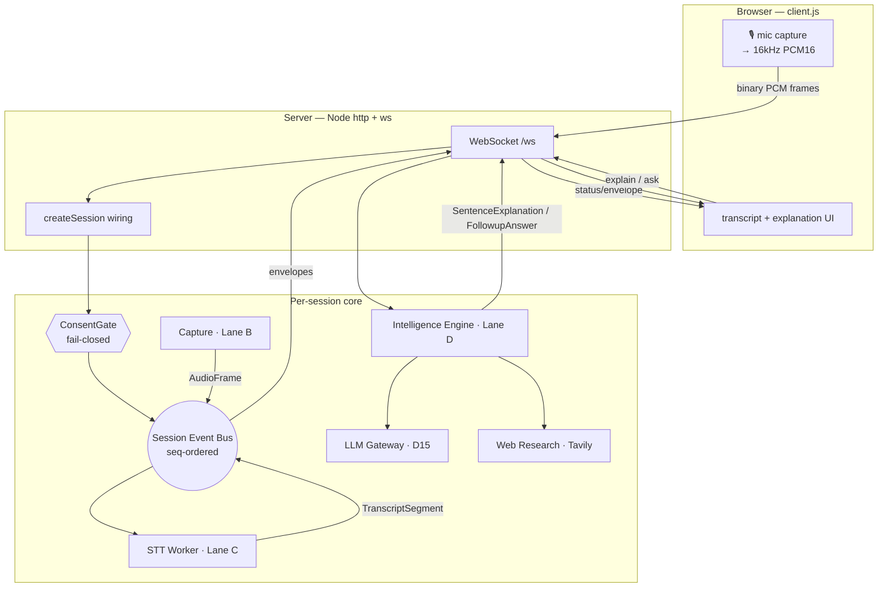

# System Architecture

Aizen is organized as a **pnpm + TypeScript monorepo**. Every box in the design maps
to a small package named `@aizen/*`, and everything communicates through **one
per-session ordered event stream** ([[The Event Bus]]) plus a few versioned
[[Data Contracts]]. This note is the master map; each package has its own deep-dive.

---

## The five lanes (F01–F05)

The original ten "teams" from the brief were sliced into **five disjoint lanes** so
they could be designed and built in parallel without colliding (decision in
[[Architecture Decisions]], and the [[How It Was Built - ClaudeTrees|build process]]).

| Lane | Owns | Domain | Notes |
|---|---|---|---|
| **F01** | Audio Capture, Speech Recognition + Diarization | ingest → transcript | [[Audio Capture and STT]] |
| **F02** | Knowledge Extraction, Explanation, Research | the AI core | [[The Intelligence Engine]] |
| **F03** | User Experience, Agent Orchestration | experience + runtime | [[The Browser Client]], [[The Server]] |
| **F04** | Infrastructure, Security/Privacy/Compliance | platform + legal-to-deploy | [[Deployment and Testing]], [[Consent and Privacy]] |
| **F05** | Product Strategy | market, pricing, roadmap | folded into [[The Account System|tiers]] |

---

## The runtime pipeline

Two ways the pipeline is driven:

1. **The deterministic spine** (`pnpm spine`) — `MockClipSource → StubStt → runIntel`
   over the bus, producing skeleton ConceptCards. This is the *full A→D chain*,
   reproducible with no clock/RNG. Wired by [[Correction Seams|SessionConductor]].
2. **The live app** (`pnpm start`) — a browser mic streams PCM to the server, which
   wires a session per WebSocket connection. Explanations are produced **on demand**
   (you click a sentence), not auto-emitted per term. Wired by `session.ts` in
   [[The Server]].

> [!note] Two clock domains, never conflated (D06)
> **Media time** (`*_ms` / `*_us` offsets from session start) orders audio content.
> **Wall-clock** (`emitted_at` / `ts_emit`) is for latency/observability only — never
> used to order media. This separation is baked into every envelope. See [[Data Contracts]].

---

## The package map

Each package is one box of the architecture. Lanes B/C/D/E code **only** against the
[[The Event Bus|bus]] interface + `@aizen/contracts`; they never import each other's
internals (decision **BD-04**).

| Package | Role | Deep dive |
|---|---|---|
| `@aizen/contracts` | the 5 canonical zod contracts + JSON-Schema export (**D06**) | [[Data Contracts]] |
| `@aizen/edge-gateway` | **Lane A** — the per-session ordered bus + seq + consent gate | [[The Event Bus]], [[Consent and Privacy]] |
| `@aizen/capture` | **Lane B** — `CaptureSource` → `AudioFrame` (mock clip; real mic via server) | [[Audio Capture and STT]] |
| `@aizen/stt-worker` | **Lane C** — STT seam: `StubSttProvider` + `DeepgramSttProvider` + diarization | [[Audio Capture and STT]] |
| `@aizen/llm-gateway` | **D15** — tier routing, cost ceilings, the salience gate; Stub + Anthropic | [[The LLM Gateway]] |
| `@aizen/research` | `WebSearchProvider` seam + Tavily adapter | [[The Intelligence Engine]] |
| `@aizen/intel-worker` | **Lane D** — extraction (skeleton cards) + explain/answer engine | [[The Intelligence Engine]] |
| `@aizen/adapter-d16` | **Seam A** — the pure F01→F02 adapter (rev/supersedes, fail-closed) | [[Correction Seams]] |
| `@aizen/seam-supersede` | **Seam B / INV-8** — provenance index, re-extract / retract | [[Correction Seams]] |
| `@aizen/seam-kg-resync` | **Seam C** — `delta_seq`↔`Position` index, resync decision tree | [[Correction Seams]] |
| `@aizen/session-conductor` | **Lane E** — deterministic spine wiring + `run-spine` demo | [[Correction Seams]] |
| `@aizen/web-client` | **Lane E** — headless render fold (the real UI lives in `server/public`) | [[The Browser Client]] |
| `@aizen/accounts` | account system — OAuth seam, swappable repo, entitlements, quota | [[The Account System]] |
| `@aizen/server` | **THE APP** — http + WebSocket: browser mic → STT → intel → live UI | [[The Server]] |

The browser UI itself is **not** a built bundle — it's plain ES2017 served from
`packages/server/public/` (`client.js`, `sources.js`, `obsidian.js`, `index.html`,
`styles.css`). See [[The Browser Client]].

---

## Design principles that recur everywhere

> [!info] The four ideas that explain most of the code
> 1. **One ordered bus per session** ([[The Event Bus|BD-01]]) — every inter-lane flow
>    is a seq-ordered envelope; nothing is shared by direct function calls across lanes.
> 2. **Seams, not branches** ([[Architecture Decisions|BD-03]]) — every external vendor
>    sits behind an interface with a deterministic **Stub** and a real adapter; call
>    sites never branch on "is it real?". The provider is chosen once, by key presence.
> 3. **Fail-closed** — absent consent denies ingress; an absent `ConsentContext` stamps
>    `sensitive`; an over-quota save is hard-rejected. The safe error is the default.
> 4. **Determinism in the spine** — the stub providers use no `Date.now()` / RNG, so the
>    whole spine is byte-reproducible and testable without the network.

---

## Related
- [[The Event Bus]] · [[Data Contracts]] · [[Correction Seams]]
- [[The Server]] · [[The Browser Client]]
- [[Architecture Decisions]] — the IDs (D, BD, INV) referenced above
- [[Glossary]] — decode any term
