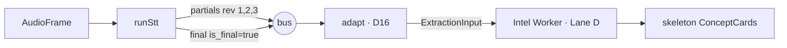

# Audio Capture and STT (Lanes B & C)

This is **F01** — turning audio into a speaker-attributed transcript. Two packages:
`@aizen/capture` (audio → `AudioFrame`) and `@aizen/stt-worker` (`AudioFrame` →
`TranscriptSegment`). Both publish onto [[The Event Bus]] and produce
[[Data Contracts|F01 contracts]]. Everything is a [[Architecture Decisions|BD-03]] seam:
a deterministic **Stub** with a real adapter behind the same interface.

---

## Lane B — Capture (`@aizen/capture`)

A `CaptureSource` yields raw, media-clock-stamped PCM chunks; `startCapture` turns those
into spec-valid `AudioFrame`s on the bus with **bus-assigned seqs** (BD-01 — the producer
never invents `seq`).

```ts
interface CaptureSource { frames(): Iterable<AudioChunk> | AsyncIterable<AudioChunk>; }
interface AudioChunk    { startMs; durationMs; samples; }   // samples count, not bytes
```

- **`MockClipSource`** (`source.ts`) — the deterministic Phase-0 fixture: a fixed list of
  contiguous 20 ms / 320-sample chunks (20 ms @ 16 kHz mono). **No mic, no network, no
  wall-clock** — fully reproducible.
- **`startCapture`** (`capture.ts`) — drives the source (sync *or* async via `for await`),
  building each `AudioFrame` with fixed wall-clock anchors so the spine stays
  deterministic, and publishing in `nextSeq('f01')` order so the bus's strict-next check
  always holds.

> [!note] Where the real mic lives
> In the live app the **browser** captures the mic and downsamples to 16 kHz PCM16 before
> sending it over the WebSocket — that path is in [[The Browser Client]]. Lane B's
> `MockClipSource` drives the *demo* spine; the real audio bytes are bridged to Deepgram
> by the server, not by Lane B.

---

## Lane C — STT Worker (`@aizen/stt-worker`)

`runStt(session, bus, provider)` subscribes from seq 0, transcribes every `AudioFrame`,
and publishes each produced `TranscriptSegment` with a bus-assigned f01 seq.

```ts
function isAudioFrame(env): env is AudioFrame {        // discriminate to avoid a feedback loop
  return !('message_type' in env) && 'codec' in env;   // only AudioFrames carry `codec`
}
```

### The STT seam (`provider.ts`)
```ts
interface SttProvider { transcribe(frame: AudioFrame): Iterable<TranscriptSegment>; }
```

- **`StubSttProvider`** — the deterministic stand-in. Each `transcribe(frame)` appends one
  word from a fixed table (`['so','the','quarterly','ARR','is','up']`) and emits a growing
  `is_final:false` **partial**. The utterance closes — emitting the terminal
  `is_final:true` **final** — on a boundary frame (`samples === 0` silence, or after
  `wordsPerUtterance` words). The final reuses the utterance's `segment_id`, carries a
  higher `rev`, and sets `supersedes` to the partial it replaces.

> [!important] Why the stub reproduces the partial→final lifecycle
> This `rev`/`supersedes` behavior is **exactly** what the downstream
> [[Correction Seams|supersede seam (INV-8)]] relies on. By baking the correction
> lifecycle into the stub, the seam can be tested end-to-end with no real STT.

- **`DeepgramSttProvider`** (`provider-deepgram.ts`) + **`runStreamingStt`**
  (`streaming.ts`) — the real, live path (P1). The server feeds it raw PCM16; it opens a
  Deepgram live socket (`diarize=true`, smart-format) and republishes `TranscriptSegment`s.
  A failure to open the vendor socket is logged and **does not** reject session creation
  (otherwise the client's "Start listening" button would hang forever).

---

## Diarization — who said what (`diarization.ts`)

> [!bug] The fix this module exists for
> Deepgram live STT returns a **per-word** `speaker` index when `diarize=true`. The old
> mapper collapsed a whole utterance onto the **first word's** speaker and threw the rest
> away — so a turn that changed speakers mid-utterance was silently mis-attributed, and
> `speaker_confidence` / `is_overlap` were hard-coded constants that *lied*. This module
> is the pure, tested core that fixes the highest-leverage finding in the speaker report.

`diarizeWords(words, opts)` maps Deepgram's words onto the contract `words[]` (each
carrying its **own** `speaker_id`) and derives the segment-level speaker honestly:

| Output | How it's derived |
|---|---|
| `speaker_id` | **duration-weighted majority** — the speaker with the greatest summed word duration; ties break toward the earliest-arriving speaker |
| `speaker_confidence` | the dominant speaker's **share of voiced duration** (clean single speaker → 1.0; even overlap → ~0.5) — *calibrated, not a constant* |
| `is_overlap` | `true` when ≥2 distinct speakers appear among the words |
| `speaker_count` | distinct speaker count (diagnostic) |

Defensive fallback: when every word has non-positive duration (garbled interim
timestamps), it falls back to **word count** so a dominant speaker is still chosen. There
is also a **DER harness** (`der.ts` — Diarization Error Rate) to evaluate attribution
quality.

> [!note] Verified against the vendor
> Live streaming words carry **no per-word `speaker_confidence`** (that field is
> pre-recorded only), which is exactly why confidence is *derived* here rather than read
> off the wire.

---

## How a final segment becomes intelligence



The final is adapted by the [[Correction Seams|D16 adapter]] into an `ExtractionInput`,
then [[The Intelligence Engine|Lane D]] extracts skeleton ConceptCards. In the **live
app**, transcript is shown immediately and explanations are produced *on demand* (you
click a sentence) rather than auto-extracted per term.

---

## Related
- [[The Event Bus]] — where frames and segments flow
- [[Data Contracts]] — `AudioFrame`, `TranscriptSegment`, the `words[]`/`speaker` shapes
- [[Correction Seams]] — the D16 adapter + the supersede lifecycle the stub reproduces
- [[The Intelligence Engine]] — what consumes the transcript
- [[The Browser Client]] — where the *real* mic capture / PCM16 downsampling happens
