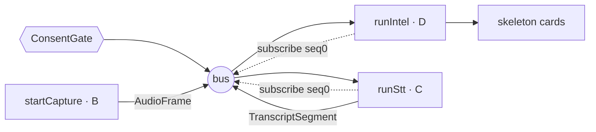

# Correction Seams (A · B · C) + the Spine

> [!abstract] Why these exist
> Live speech gets **corrected**: a partial "the quarterly ay-ar-ar" finalizes to
> "the quarterly **ARR**". When that happens, anything the engine already extracted from
> the wrong text must be **re-extracted or un-rendered**. The original design left these
> as prose arrows; the validation pass (blueprint **doc 10**) turned them into three
> real, tested packages. These directly fix the [[How It Was Built - ClaudeTrees|H-7/H-8
> "hidden disagreement" bug]].

The three seams are the F01→F02 boundary plumbing; the **SessionConductor** is the
deterministic wiring that runs the whole A→D chain.

---

## Seam A — the D16 adapter (`@aizen/adapter-d16`)

The **only** component that ever sees raw F01 fields. `adapt(seg, consent)` is **pure and
stateless** (no network/store/LLM) and translates a `TranscriptSegment` into the
`ExtractionInput` Lane D expects.

```ts
adapt(seg, consent): ExtractionInput
//  ms → µs (×1000)              t_start_us / t_end_us, tagged clock:'media'   [INV-A2]
//  unwrap speaker.{...}         speaker_id / speaker_label / speaker_confidence
//  rename language → lang
//  segment_id stays an opaque string (never parsed as a UUID)                 [C-2]
//  rev + supersedes CARRIED                                                    [INV-A1 / H-7]
//  consent → consent_class / pii_present, FAIL-CLOSED if absent               [INV-A4 / D20]
```

> [!bug] The H-7 regression guard
> The original field map **silently dropped `rev` and `supersedes`**, breaking all
> correction semantics downstream (two lanes agreed on the field *name* but not its
> *meaning*). The D16 amendment restored them, and a contract test now guards against the
> regression forever. Missing consent stamps `sensitive + pii_present=true` rather than
> inventing `'standard'` — see [[Consent and Privacy]].

---

## Seam B — supersede / correction propagation (`@aizen/seam-supersede`)

The missing link that closed **H-8** (stale cards citing superseded text — an INV-1
violation). It supplies a **provenance index**, a **propagation algorithm**, and the
**`retracted` un-render path**.

```ts
// Provenance index: segment_id → the artifacts that cite it
interface ProvenanceEntry { conceptCardIds; kgNodeIds; kgEdgeIds; insightIds; }
cardCitedSegments(card)   // the segment ids a card's live provenance points at
```

When a `supersedes` correction arrives, the seam looks up every artifact citing the
superseded segment and either **re-extracts** it (injecting a pluggable `ReExtractor` so
the algorithm is testable without the LLM) or **retracts** it (a `ConceptCard` flips to
`state:'retracted'` with a `retraction{}` block; the KG retracts via
`kg_delta.remove_*_ids`).

> [!important] INV-8 — no live citation of superseded text
> Within a propagation budget (≤ 2 s p95 from arrival), **no non-`retracted` artifact may
> carry a superseded `segment_id`** in its live provenance. The
> [[Data Contracts|ConceptCard contract]] enforces the state↔retraction invariant with a
> zod refine, so the UI ([[The Browser Client]]) can simply un-render any card it sees go
> `retracted`.

---

## Seam C — KG resync (`@aizen/seam-kg-resync`)

Closes **C-7** — the resync protocol that was left as a prose arrow. The gap was the
translation between F02's application-level `delta_seq` and the bus's opaque `Position`
(Event Hubs offset / Kafka offset).

```ts
class DeltaIndex {        // delta_seq ↔ Position (production: DynamoDB/Cosmos per session)
  record(deltaSeq, position); has(deltaSeq); resolve(deltaSeq): Position | undefined;
}
resolveResync(...)        // the §3.5 decision tree: replay deltas vs. splice a fresh snapshot
```

If a consumer falls behind or detects a gap, `resolveResync` decides whether to **replay
deltas** from a known `Position` or **splice a fresh `kg_snapshot`** and resume. A content
hash (`createHash`) lets it verify the snapshot baseline. This is what makes "a durable,
ordered, **replayable** per-session stream" (D13) actually recoverable.

---

## The Spine — `SessionConductor` (`@aizen/session-conductor`)

**Lane E.** The per-session orchestrator and the **only** lane that imports the others'
public exports (BD-04) — it reuses them as-is and reinvents nothing. `run-spine.ts` runs
it end-to-end and prints the result (`pnpm spine`).

```ts
start(session, opts): SessionEventBus {
  if (!gate.admit(session, opts.consent)) throw …;   // consent FIRST (fail-closed)
  const bus = new InMemorySessionBus();
  const intel = runIntel(...);            // Lane D first → subscribes from seq 0
  guarded(() => runStt(...));             // Lane C
  guarded(() => startCapture(...));       // Lane B last → subscribers already attached
}
```

Order matters: **Lane D subscribes first** (so it sees every later F01 envelope), then C,
then B publishes. Each worker starts inside a **failure-recovery `try/catch`** (`guarded`)
— a throw while wiring one worker is logged and the session continues with whatever
started. It's the Phase-0 stand-in for the real restart/resync ladder; it never tears the
whole session down. `drain(session)` awaits the intel worker's in-flight async so tests
can assert on a settled render.



> [!note] Spine vs. live app
> The conductor drives the **deterministic demo spine** (`MockClipSource` + `StubStt`).
> The **live app** ([[The Server]] `session.ts`) is the real-time analogue: same bus, same
> consent gate, but driven by a browser mic and Deepgram, and it produces explanations
> *on demand* rather than auto-extracting per term.

---

## Related
- [[Data Contracts]] — `rev`/`supersedes`, the `retracted` state, `kg_delta`/`kg_snapshot`
- [[Audio Capture and STT]] — the stub STT reproduces the exact `rev`/`supersedes` lifecycle
- [[The Intelligence Engine]] — the extractor the supersede seam re-runs
- [[The Event Bus]] — gap recovery is the resync seam's job, not the bus's
- [[The Blueprint Documents]] — doc 10 (seam contracts) produced these packages
- [[How It Was Built - ClaudeTrees]] — the H-7/H-8 bug these fix
