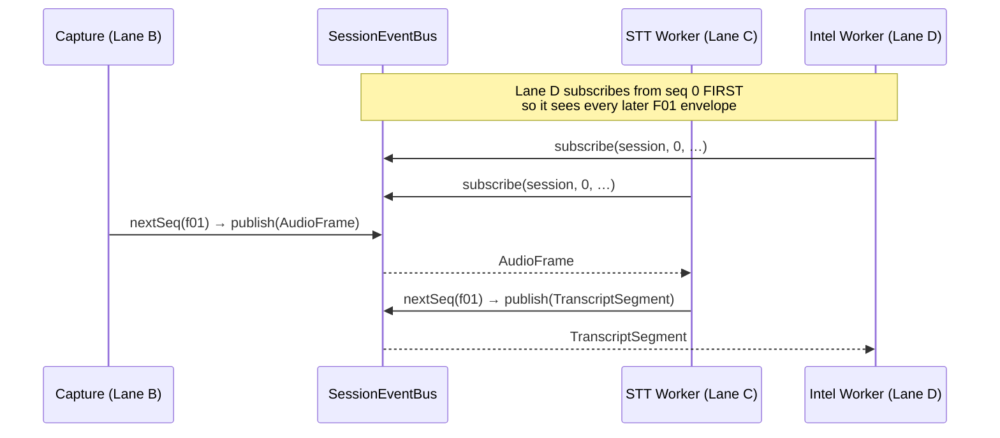

# The Event Bus

> [!abstract] The spine of the whole system
> Every inter-lane data flow in Aizen rides **one append-only, seq-ordered log per
> session** with live fan-out. It is the in-process Phase-0 stand-in for Azure Event
> Hubs / Kafka ([[Architecture Decisions|D13]]). Lanes never import each other's
> internals — they only publish and subscribe through this one interface (**BD-04**).

- **Package:** `@aizen/edge-gateway` (**Lane A**)
- **Files:** `src/bus.ts` (the bus), `src/seq.ts` (the seq assigner), `src/consent-gate.ts`
  (the [[Consent and Privacy|consent gate]]), `src/index.ts` (exports)
- **Decision:** **BD-01** — one ordered bus per session; `seq` is the bus's to mint.

---

## The interface

Other lanes code against `SessionEventBus`, never the concrete class:

```ts
export interface SessionEventBus {
  nextSeq(session, cls): number;                  // monotonic seq per session+class
  publish(session, env): void;                    // append a seq'd envelope (strict-next)
  subscribe(session, fromSeq, fn): () => void;    // replay from fromSeq, then stream live
  history(session): readonly Envelope[];          // full ordered log (tests/inspection)
}
```

An `Envelope` is either an **F01** envelope (`AudioFrame` / `TranscriptSegment`) or an
**F02** envelope (intelligence). They are discriminated by one field: *F02 envelopes
carry a `message_type`; F01 envelopes do not.* See [[Data Contracts]].

```ts
function classOf(env): 'f01' | 'f02' {
  return 'message_type' in env ? 'f02' : 'f01';
}
```

---

## How `InMemorySessionBus` works

Per session it keeps an append-only `log`, a set of live `subscribers`, and the next
`expected` seq for each class.

### Publishing is *strict-next*
```ts
publish(session, env) {
  const expected = s.expected.get(cls) ?? 0;
  if (env.seq !== expected) throw new Error(`seq violation: expected ${expected}, got ${env.seq}`);
  s.expected.set(cls, expected + 1);
  s.log.push(env);
  for (const fn of [...s.subscribers]) fn(env);   // snapshot tolerates unsubscribe-in-callback
}
```

An envelope is accepted **only** if its `seq` equals the next expected seq for its class
(the value `nextSeq` would have handed it). Out-of-order *and* duplicate seqs are
**rejected (they throw)**. Gap recovery is deliberately *not* the bus's job — that's the
[[Correction Seams|resync seam's]] concern.

### Subscribing = replay then live
```ts
subscribe(session, fromSeq, fn) {
  for (const env of s.log) if (env.seq >= fromSeq) fn(env);  // replay in log == seq order
  s.subscribers.add(fn);
  return () => s.subscribers.delete(fn);                     // unsubscribe
}
```

This "replay from `fromSeq`, then stream every later publish" is exactly the durable,
ordered, replayable guarantee **D13** promises for the production Event Hubs/Kafka
backbone — modeled in-process so the rest of the code can rely on it now.

---

## Two seq classes per session

`seq` is **monotonic per session, per message class** (`f01` vs `f02`). The `SeqAssigner`
(`seq.ts`) hands out the next number; producers must use it and never invent their own —
that's the BD-01 rule that keeps strict-next publishing sound.

> [!note] Why two classes?
> Audio/transcript (F01) and intelligence (F02) are produced by different lanes at
> different rates. Separate seq spaces let each advance independently while each stays
> strictly ordered within itself. `seq` is logically uint64; JSON loses precision above
> 2^53, so at scale the wire may carry it as a string — Phase-0 uses a plain integer.

---

## Who publishes and subscribes



- [[Audio Capture and STT|Capture]] publishes `AudioFrame`s with bus-assigned f01 seqs.
- [[Audio Capture and STT|STT]] subscribes, transcribes each `AudioFrame`, and publishes
  `TranscriptSegment`s (also f01) — skipping its own segments to avoid a feedback loop
  (it discriminates on `codec`, which only AudioFrames carry).
- In the live app, [[The Server|session.ts]] subscribes a forwarder that relays every
  envelope to the browser over the WebSocket and snapshots final transcript lines for
  follow-up context.

---

## Related
- [[Data Contracts]] — the envelopes that ride the bus
- [[Audio Capture and STT]] — the producers
- [[Correction Seams]] — gap recovery / resync (deliberately *not* the bus's job)
- [[Consent and Privacy]] — the fail-closed gate that runs *before* any bus exists
- [[The Server]] · [[Architecture Decisions|BD-01 / D13]]
