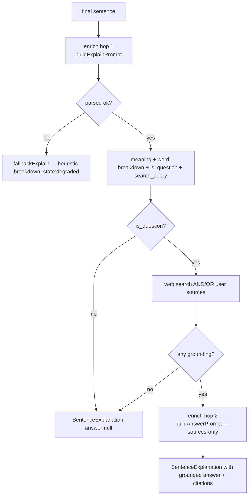

# The Intelligence Engine (Lane D)

> [!abstract] The AI core
> This is **F02** — the part that *understands and teaches*. It has two faces: a
> deterministic **extraction** path (transcript → skeleton ConceptCards, for the spine)
> and an on-demand **explain/answer** engine (click a sentence → meaning + word breakdown
> + a grounded answer). It calls models only through [[The LLM Gateway]] and grounds
> answers through web research + your own [[S0 - Source Library and Retrieval|sources]].

- **Package:** `@aizen/intel-worker` (+ `@aizen/research` for web search)
- **Key files:** `src/explain.ts` (the explain/answer engine), `src/extract.ts`
  (skeleton extraction), `src/enrich.ts` + `enrich-worker.ts` (enrichment), `src/worker.ts`
  (`runIntel` — the spine subscriber)

---

## Path A — extraction for the spine (`extract.ts`)

From one final `ExtractionInput`, `extractFromFinal` produces the Phase-0 skeleton
artifacts: a `ConceptCard (state:'skeleton')` per salient term, an `InsightItem` per card
(with ≥1 transcript citation — **INV-4**), and one `kg_delta` with a monotonic `delta_seq`.

```ts
function salientTerms(text): string[]   // heuristic: ALL-CAPS acronyms + Capitalized words
```

> [!note] Deterministic by design
> Term selection is a **heuristic, not an LLM judgement**, and ids/timestamps derive only
> from the input (`segment_id`, seq, `t_*_us`) — no wall-clock, no RNG. Re-running on the
> same input is byte-stable. The gateway *is* still invoked (`kind:'extract'` → Haiku) so
> the seam to the real extractor is wired and cost-metered (**BD-04**), but its text isn't
> parsed in Phase 0. `runIntel` (`worker.ts`) wires this onto [[The Event Bus|the bus]] for
> the [[Correction Seams|conductor spine]].

---

## Path B — the explain engine (`explainSentence`)

This is what the live app calls when you click a finished sentence
([[F2 - Sentence Explanation and BYO Sources]]). It **always resolves** to a
`SentenceExplanation` — it never throws, even on a degraded gateway or an unanswerable
question.

```ts
explainSentence(input, gateway, opts) → SentenceExplanation
// opts: { research?, maxSources?, userSources? }
```

It makes **at most two LLM hops**:



1. **Explain + break down + classify** (`kind:'enrich'` → Sonnet). The prompt asks for a
   strict JSON object: a plain-language `explanation`, a `breakdown[]` of up to 6 notable
   words, `is_question`, and a `search_query`. **Your connected sources are folded into
   *this* prompt too**, so the explanation itself is grounded in your context — not only
   the answer.
2. **Answer (questions only)** — gather web sources (via `WebSearchProvider`) **and/or**
   user sources, then a second `enrich` hop synthesizes a 1–3 sentence answer **using only
   those sources**.

> [!important] Grounding posture — no hallucinated answers
> The answer prompt pins the model to the retrieved sources and asks it to reply
> **exactly `"unknown"`** when they don't contain the answer. No answer is synthesized
> without sources, so questions never hallucinate from parametric memory alone. An
> "unknown" verdict becomes a `null` answer with the sources kept as leads.

> [!tip] BYO sources make answers work with no Tavily key
> Because user sources are independent grounding, the engine answers whenever there is
> **any** grounding (web *or* user). So a question can be answered **purely from your
> Obsidian vault / files / pasted notes** even with web search disabled — that's the whole
> point of [[S0 - Source Library and Retrieval|BYO sources]].

### Lenient + strict parsing
`firstJsonObject()` extracts the first `{…}` from the model text. The explain hop parses
**leniently** (falls back to a heuristic `pickKeyWords` breakdown + `looksLikeQuestion`
detection if the model returns prose). The follow-up answer parses **strictly** — a
non-JSON reply (e.g. the deterministic stub's marker text) becomes `state:'degraded'`
rather than echoing junk to the user.

---

## Path C — follow-up answers (`answerFollowup`)

For [[F1 - Follow-up Answers|typed follow-ups]] about an already-explained sentence.
Unlike `explainSentence` (which never sees the transcript), this grounds the answer in
**both** the supplied conversation `context` *and* web/user sources — so
"what did he mean by that?" gets a real answer, while outside-fact questions still carry
web citations. One web search + at most one `enrich` hop; always resolves.

---

## Citations & provenance

Both engines emit `ExplanationSource` citations. A web source must carry a `url`
(**INV-1/2**); user sources keep their **origin** as the citation `type` so the UI can
icon/group them:

```ts
function userCitation(id, u): ExplanationSource {
  type = u.origin === 'file' ? 'file' : u.origin === 'obsidian' ? 'obsidian' : 'user';
  ...
}
```

So a vault-grounded answer renders a `🔮 <note path>` chip; a file renders a file chip; a
pasted note renders a plain "user" chip. See [[F4 - Obsidian Vault Connection]].

---

## Web research & grounding (`@aizen/research`)

The research package is the **grounding seam** (BD-03). Output is shaped toward F02:
each result becomes a `WebSource` the engine turns into a `type:'web'` citation.

```ts
interface WebSearchProvider { search(query, opts?): Promise<WebSearchResult>; }
```

| Provider | When | Behavior |
|---|---|---|
| `TavilyWebSearchProvider` | `WEB_SEARCH_PROVIDER=tavily` + key | POSTs to Tavily, maps `results[]` → `WebSource[]` |
| `NullWebSearchProvider` | no key | returns empty — callers never branch on "search off" |

> [!warning] The "Answering… forever" guard
> Node's global `fetch` has no overall response timeout, so a stalled Tavily connection
> would hang the whole explain/follow-up call (a grounded answer always runs a search
> first). The adapter aborts after `timeoutMs` (default **9 s**) via an `AbortController`;
> the engine catches and degrades to "no sources." The session adds a further 30 s
> backstop — see [[The Server]].

---

## Related
- [[The LLM Gateway]] — every model call (`kind:'enrich'`/`'extract'`) routes through it
- [[Data Contracts]] — `SentenceExplanation`, `FollowupAnswer`, `ExplanationSource`, `ConceptCard`
- [[F2 - Sentence Explanation and BYO Sources]] · [[F1 - Follow-up Answers]] — the features this powers
- [[S0 - Source Library and Retrieval]] — how user sources are selected before they reach here
- [[Correction Seams]] — extraction's correction/retraction lifecycle
