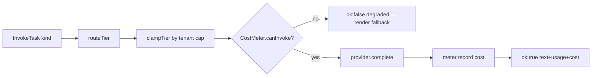

# The LLM Gateway (D15)

> [!abstract] One door to the models
> Every LLM call in Aizen goes through **one gateway**. F02/F03 never call a provider
> directly ([[Architecture Decisions|D15]]). The gateway encodes three things the design
> depends on: **tier routing** (which Claude model for which task), **cost accounting +
> ceilings**, and the **salience/stability gate** (the shared control point for *both*
> latency and cost).

- **Package:** `@aizen/llm-gateway`
- **Files:** `src/index.ts` (gateway, routing, cost meter, stub), `src/provider-anthropic.ts`
  (the real adapter)
- **Provider seam (BD-03):** `StubProvider` (no network) ↔ `AnthropicProvider` (real)

---

## Tier routing (D04)

A task `kind` maps to a Claude tier. The hot explanation path is Sonnet; deep dives are
Opus; everything cheap (route/classify/extract/verify/summarize) is Haiku.

```ts
function routeTier(kind: TaskKind): Tier {
  case 'enrich': return 'sonnet';   // the real-time hot explanation path
  case 'deep':   return 'opus';     // deep dive, on demand
  default:       return 'haiku';    // route/classify/extract/verify/summarize
}
```

A per-tenant **tier cap** clamps the routed tier (e.g. Free = Haiku-only — wired from the
[[The Account System|entitlement table]]):

```ts
function clampTier(routed, cap) { return ORDER[routed] <= ORDER[cap] ? routed : cap; }
```

---

## Cost accounting & ceilings (the #1 risk)

Cost is the project's top risk (**RISK-1**). The gateway meters every call against a
published rate card and enforces two hard limits.

```ts
RATES_PER_MTOK = { haiku:{in:1,out:5}, sonnet:{in:3,out:15}, opus:{in:15,out:75} };
const CACHE_READ_MULTIPLIER = 0.1;   // cached input billed at 0.1× (prompt caching)

costUsd(tier, usage) = (cachedIn*r.in*0.1 + freshIn*r.in + out*r.out) / 1e6;
```

The **`CostMeter`** tracks spend and Opus escalations and refuses calls past a ceiling:

```ts
canInvoke(tier) {
  if (spent >= tenantCeilingUsd)              return { ok:false, reason:'tenant_cost_ceiling' };
  if (tier==='opus' && opusCalls>=opusCallCap) return { ok:false, reason:'opus_escalation_cap' };
  return { ok:true };
}
```

In the live app the session sets `TENANT_CEILING_USD = 5` and `OPUS_CALL_CAP = 4` (see
[[The Server]]). A refusal returns a **degraded** result — it never throws — so the
caller always has something to render.

---

## The invoke flow

```ts
async invoke(task): InvokeResult {
  const tier = clampTier(routeTier(task.kind), task.tierCap);
  const guard = meter.canInvoke(tier);
  if (!guard.ok) return { ok:false, degraded:true, tier, reason: guard.reason };  // never throws
  const res  = await provider.complete({ tier, prompt, ...estTokens });
  const cost = meter.record(tier, res.usage);
  return { ok:true, tier, text: res.text, usage: res.usage, costUsd: cost };
}
```



---

## The salience / stability gate (D17)

The gateway also owns the **speculative-extraction gate** — the single knob that bounds
*both* perceived latency and the `enrichments/min` cost lever (**D17**):

```ts
function shouldSpeculativelyExtract(sig, cfg = {minStableMs:300, minSalience:0.5}) {
  if (sig.stableMs  < cfg.minStableMs)  return false;   // hysteresis — wait for stability
  if (sig.salience  < cfg.minSalience)  return false;   // only salient terms
  return sig.confidenceBand === 'high' || sig.isDomainTerm;
}
```

> [!info] One control point, two budgets
> Tune this gate once and you move both the latency budget (don't extract on noisy
> partials) and the cost model (don't pay to enrich low-value terms). That's why D17
> calls it "the shared control point."

---

## The real provider (`provider-anthropic.ts`)

`AnthropicProvider` implements the same `LlmProvider` interface as the stub and is
re-exported from the gateway's public surface (consumers import it from `@aizen/llm-gateway`).
It maps the gateway's tiers to concrete model IDs (`DEFAULT_MODELS`) and is swapped in
purely by the presence of `ANTHROPIC_API_KEY` — see [[The Server]] `buildGateway`. The
[[The Intelligence Engine|explain/answer engine]] is its main caller.

---

## Related
- [[The Intelligence Engine]] — the gateway's primary caller (`kind:'enrich'`/`'extract'`)
- [[The Account System]] — where the per-tier `model_tier_cap` (Free=haiku) comes from
- [[Architecture Decisions|D04 / D15 / D17]]
- [[The Server]] — builds the gateway with the live ceilings
