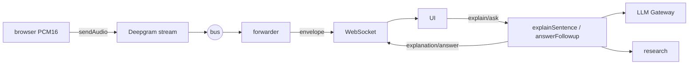

# The Server (`@aizen/server`)

> [!abstract] The runnable app
> An **HTTP server** (serves the browser UI + account routes) and a **WebSocket
> endpoint** (one live session per connection). It layers the
> [[The Account System|account system]] *around* the existing mic→STT→intel pipeline
> without changing it. Start it with `pnpm start` → http://localhost:5173.

- **Files:** `src/index.ts` (http + ws entrypoint), `src/session.ts` (one live session's
  wiring), `src/config.ts` (env), `src/accounts.ts` (account HTTP routes).
- **Static UI:** served from `packages/server/public/` — see [[The Browser Client]].

---

## `index.ts` — http + WebSocket entrypoint

### Request routing
Every request first offers itself to the [[The Account System|account routes]]
(`handleAccountRequest`); if not handled, it falls through to **static assets**. Notable:

- `cache-control: no-store` on the UI files so a plain refresh always gets the latest.
- A **traversal-safe** `/vendor/<path>` resolver lets the client lazily `import()`
  vendored assets (e.g. `/vendor/pdf.mjs` for [[F3 - Local File Sources|PDF extraction]]);
  an absent file 404s cleanly.
- Load order in `index.html`: `/sources.js` → `/obsidian.js` → `/client.js`.

### One WebSocket = one session
```ts
wss.on('connection', (ws) => {
  createSession(cfg, status, (env) => send({ type:'envelope', env }))   // relay bus → browser
    .then((s) => send({ type:'status', sessionId, mode, providers: status }));
  ws.on('message', (data, isBinary) => {
    if (isBinary) session.sendAudio(new Uint8Array(data));              // PCM16 mic frames
    else handleControlFrame(JSON.parse(data));                          // explain / ask / stop
  });
});
```

The **first frame** to the client is a `{type:'status'}` describing which real providers
are active, so the UI can show **LIVE vs DEMO**. Every bus envelope is relayed as
`{type:'envelope'}`.

### The WebSocket protocol

| Direction | Message | Meaning |
|---|---|---|
| → server | *binary* | PCM16LE 16 kHz mono mic audio (bounded by the capture pipeline) |
| → server | `{type:'explain', segment_id, text, user_sources}` | explain a clicked sentence |
| → server | `{type:'ask', segment_id, question, ask_id, sentence, transcript, user_sources}` | a typed [[F1 - Follow-up Answers\|follow-up]] |
| → server | `{type:'stop'}` | end the session |
| ← client | `{type:'status', mode, providers}` | LIVE/DEMO + active providers |
| ← client | `{type:'envelope', env}` | a bus envelope (transcript, …) |
| ← client | `{type:'explanation', explanation}` | a `SentenceExplanation` |
| ← client | `{type:'answer', ask_id, answer}` / `answer_error` | a `FollowupAnswer` |
| ← client | `{type:'explain_error', segment_id, message}` | explain failed (retryable) |
| ← client | `{type:'error', message}` | fatal session error |

> [!note] Bounded inputs
> A JSON control frame over `MAX_WS_TEXT_BYTES` (512 KB) is dropped, not parsed. The
> attached `user_sources` are validated and bounded by `coerceUserSources` (≤ 40 items,
> ≤ 4 KB each, **≤ 64 KB aggregate**) — user text is conversation data, passed to the
> engine but never logged raw (team-09). See [[S0 - Source Library and Retrieval]].

---

## `session.ts` — one live session's wiring

The real-time analogue of the [[Correction Seams|SessionConductor spine]], but driven by
a browser mic instead of the fixture clip. `createSession`:

1. Mints a `session_id`, builds a default `ConsentContext`, and **fails closed** through
   the `ConsentGate` *before any bus exists* (see [[Consent and Privacy]]).
2. Builds **one** `InMemorySessionBus`, the [[The LLM Gateway|gateway]]
   (`TENANT_CEILING_USD = 5`, `OPUS_CALL_CAP = 4`), and the
   [[The Intelligence Engine|research provider]].
3. Subscribes a **forwarder** that relays every envelope to the browser **and** snapshots
   recent final transcript lines into a rolling buffer (`recentFinals`, last 12) for
   follow-up context.
4. Attaches a transcription source by **mode** (BD-03):
   - **live** (`DEEPGRAM_API_KEY` present) → `runStreamingStt` bridges browser PCM → Deepgram.
   - **demo** (no key) → the deterministic stub spine (`MockClipSource` + `StubStt`) so the
     page still shows the flow — and, if an Anthropic key is set, a **real** explanation of it.



### On-demand explain & ask
`explain(segmentId, text, userSources)` and `ask(...)` call the
[[The Intelligence Engine|engine]]. Both are wrapped in `withTimeout(..., 30 000ms)`:

> [!important] The "Answering… forever" backstop
> The engine already bounds its own search + model calls, but `withTimeout` **guarantees**
> the WebSocket handler always gets a reply to send — if anything upstream wedges past
> 30 s, it resolves a **degraded** result instead of leaving the browser spinning. It
> never rejects.

> [!tip] Why the client re-sends context
> A fresh WebSocket is a fresh server session with an **empty** `recentFinals`. So the
> client ships the `sentence` + recent `transcript` *with each ask*, and `user_sources`
> ride every request — so a follow-up (and BYO grounding) **survives a reconnect** with no
> server-side session state. `ask` prefers the client-shipped context, falling back to its
> own buffer.

---

## `config.ts` — configuration & provider status

Loads `.env` from the repo root (dotenv). Empty strings are treated as **absent**, so
"is this provider configured?" is a simple presence check, and **no secret is ever
logged** — only whether each is set. `providerStatus(cfg)` computes the
`{stt, llm, search, auth}` status the banner and UI render. Full key list in
[[Running and Configuring]].

---

## Related
- [[The Browser Client]] — the other half of the WebSocket protocol
- [[The Account System]] — the HTTP routes layered around the pipeline (`accounts.ts`)
- [[The Intelligence Engine]] — what `explain`/`ask` call
- [[Consent and Privacy]] — the fail-closed gate in `createSession`
- [[The Event Bus]] · [[The LLM Gateway]] · [[Running and Configuring]]
