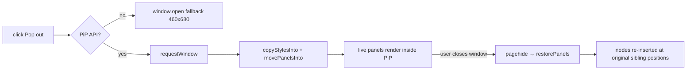

# Document Picture-in-Picture

> [!abstract] Keep watching while you work
> The **"Pop out"** button floats the live **Transcript + Explanation** panels into a
> small, always-on-top window, so you can keep reading the conversation while another app
> is focused. Part of the [[F2 - Sentence Explanation and BYO Sources|F2 family]];
> implemented entirely in [[The Browser Client|client.js]] (~lines 1641–1743).

---

## The trick: move the nodes, don't clone them

It uses the **Document Picture-in-Picture API** and **adopts** the live DOM nodes into the
PiP document rather than copying them.

```js
function popOut() {
  if (pipWindow) { pipWindow.close(); return; }                 // toggle: "Return"
  if (!documentPictureInPicture) return fallbackPopout();       // plain window.open fallback
  const win = await documentPictureInPicture.requestWindow({ width:460, height:680 });
  copyStylesInto(win);            // PiP windows start unstyled → clone <link>/<style>
  win.document.documentElement.dataset.theme = openerTheme;     // match light/dark
  movePanelsInto(win.document.body);   // appendChild ADOPTS the live transcript + explanation
}
```

> [!important] Why move-not-clone matters
> Because the nodes are **moved**, every cached `els.*` reference, every listener (the
> transcript click handler, the follow-up form), and the render loop
> (`renderTranscript` / `renderExplanation` / `renderFollowups`) keep targeting the same
> elements and keep updating them in their new home. The WebSocket + model code in the
> opener stays untouched — there is **no second render path** to keep in sync.

`movedPanels[]` records each node's `{el, parent, next}` so restore is exact.

---

## Lifecycle



- **Restore** (`onPipClosed` → `restorePanels`) re-inserts each node at its original
  position, nulls `pipWindow`, and resets the button label. Re-entrancy is guarded by
  `popoutBusy`.
- **Theme sync** — `setTheme` mirrors `data-theme` into an open `pipWindow`, so toggling
  the theme updates both windows.
- **Fallback** — without the PiP API, `fallbackPopout` opens a plain
  `window.open(location.href, …)` so the feature degrades rather than vanishing.

---

## Related
- [[The Browser Client]] — where this lives, and the `els`/render model it reuses
- [[F2 - Sentence Explanation and BYO Sources]] — the panels being popped out
- [[UI Redesign]] — the `pip-body` styling and theme tokens
