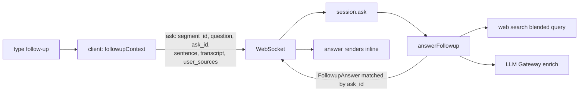

# Feature F1 — Typed Follow-up Answers

> [!abstract] What it does
> After a sentence is explained, you can **type a follow-up question about it**
> ("what did he mean by that?", "give me a simpler explanation", "how does that compare to
> X?") and get a short answer grounded in the **recent conversation context** *plus* web
> and your own sources. It's the conversational layer on top of
> [[F2 - Sentence Explanation and BYO Sources|sentence explanation]].

- **Engine:** `answerFollowup()` in `@aizen/intel-worker` (`explain.ts`) → see
  [[The Intelligence Engine]].
- **Contract:** `FollowupAnswer` (`@aizen/contracts/src/followup-answer.ts`).
- **Server:** the `{type:'ask'}` WebSocket frame in [[The Server]].
- **UI:** `submitFollowup` / `followupContext` / `applyAnswer` in [[The Browser Client]].

---

## How it differs from `explainSentence`

| | `explainSentence` (F2) | `answerFollowup` (F1) |
|---|---|---|
| Trigger | click a sentence | type a question about an explained sentence |
| Sees the transcript? | **No** (only the one sentence) | **Yes** — grounds in recent conversation context |
| Grounds in | web + user sources | conversation context **+** web + user sources |
| Result | `SentenceExplanation` | `FollowupAnswer` |

So a context-dependent question ("what did *he* mean?") gets a real answer instead of
`null`, while an outside-fact question still carries web citations (INV-1/2).

---

## The data flow

1. The client builds `followupContext(segmentId)` = `{ sentence, transcript: last 12
   final lines }` and sends `{type:'ask', …, ask_id, sentence, transcript, user_sources}`.
2. `session.ask` **prefers the client-shipped context** (its model survives reconnects,
   unlike the server's empty `recentFinals` on a fresh socket), falling back to its own
   buffer.
3. `answerFollowup` runs one web search (a query blending the question with the sentence)
   + at most one `enrich` hop, and **always resolves** — a stub/cost-capped gateway or an
   "unknown" verdict becomes `state:'degraded'` with a `null` answer, never a throw.

---

## Why it's reconnect-proof

> [!tip] The key design choice
> The browser keeps the transcript across reconnects; the server does **not** (a new
> WebSocket = a fresh session with an empty buffer). By shipping the `{sentence,
> transcript}` *with the question*, a context-dependent follow-up asked right after a
> reconnect still has its grounding. The same trick carries `user_sources`. See
> [[The Server]] and [[The Browser Client]].

## Safety backstops
- **`ask_id`** correlates the reply to the right pending question in the UI.
- A **45 s client-side timeout** (`FOLLOWUP_UI_TIMEOUT_MS`) fails a pending follow-up
  gracefully, on top of the server's 30 s `withTimeout`.
- A non-JSON model reply is parsed **strictly** → degraded, so the stub's marker text is
  never shown as an "answer."

---

## Related
- [[F2 - Sentence Explanation and BYO Sources]] — the explanation a follow-up builds on
- [[The Intelligence Engine]] — `answerFollowup` internals + grounding posture
- [[The Server]] · [[The Browser Client]]
- [[S0 - Source Library and Retrieval]] — how `user_sources` are selected
