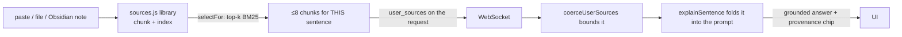

# Feature F2 — Sentence Explanation & Bring-Your-Own Sources

> [!abstract] The headline feature
> Click any **finished sentence** in the live transcript and Aizen tells you (1) what it
> **means** in plain language, (2) a **breakdown of its hard words**, and (3) if it's a
> **question**, a short **answer grounded in web search and/or your own provided sources**
> — every web claim carrying a citation. This is the product's wedge: *explain-and-teach,
> live*. See [[What Is Aizen]].

- **Engine:** `explainSentence()` in `@aizen/intel-worker` → [[The Intelligence Engine]].
- **Contracts:** `SentenceExplanation`, `ExplanationSource`, `UserSource`.
- **Server:** the `{type:'explain'}` WebSocket frame → [[The Server]].
- **UI:** `requestExplain` / `renderExplanation` → [[The Browser Client]].

---

## The output (`SentenceExplanation`)

```ts
{ sentence, explanation,
  breakdown: [{ word, meaning }, …],     // up to 6 notable words
  is_question, answer: string | null,    // grounded answer when it's a question
  sources: ExplanationSource[],          // web / user / file / obsidian citations
  state: 'ok' | 'degraded' }
```

A finished line that *looks like a question* auto-explains; everything else explains on
click. The flow (two LLM hops at most) is detailed in [[The Intelligence Engine]].

---

## Bring-Your-Own (BYO) sources

> [!abstract] Ground the AI in *your* context
> Beyond web search, you can hand the AI your own context — **pasted notes**, **local
> files** ([[F3 - Local File Sources]]), or a whole **Obsidian vault**
> ([[F4 - Obsidian Vault Connection]]). These ground both the explanation *and* the answer.

The contract is `UserSource`:

```ts
UserSource = {
  id, text,                              // text is the substance the AI reads
  title?,                                // label, filename (F3), or note path (F4)
  url?,                                  // referenced link (NOT fetched server-side)
  origin?: 'paste' | 'file' | 'obsidian' // advisory — drives citation provenance + icon
}
```

> [!tip] BYO sources answer questions with no Tavily key
> Because user sources are **independent grounding**, the engine answers whenever there is
> *any* grounding — web **or** user. So a question can be answered **purely from your
> notes/vault** even with web search off. The engine "never branches its grounding" on the
> origin — origin only changes the citation icon (`type: 'user' | 'file' | 'obsidian'`).

The journey of a BYO source from your browser to a grounded answer:



The selection is **retrieval, not dumping** — only the few chunks relevant to the current
sentence are sent, bounded by a small grounding budget. That machinery is
[[S0 - Source Library and Retrieval]]. The server bounds it again
(`coerceUserSources`: ≤ 40 items, ≤ 64 KB aggregate — [[The Server]]), and it's kept
client-side, in-memory, never logged raw ([[Consent and Privacy]]).

---

## Privacy posture (team-09)

User text is **conversation data** and rides the same consent posture as the transcript:
client-side + in-memory, only the S0-selected chunks shipped per request, never logged
raw. URLs are *not* fetched server-side (out of scope) — they ride along as context and
render as a link on a cited source.

---

## Companion features in the F2 family

- **[[Document Picture-in-Picture]]** — float the transcript + explanation into a small,
  always-on-top window so you can keep watching while you work.
- **[[F1 - Follow-up Answers]]** — type follow-up questions about an explained sentence.

---

## Related
- [[The Intelligence Engine]] — `explainSentence` internals, parsing, grounding posture
- [[S0 - Source Library and Retrieval]] — chunking + BM25 selection of BYO sources
- [[F3 - Local File Sources]] · [[F4 - Obsidian Vault Connection]] — where BYO sources come from
- [[F1 - Follow-up Answers]] · [[Document Picture-in-Picture]]
- [[Data Contracts]] — `SentenceExplanation`, `UserSource`, `ExplanationSource`
