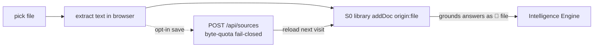

# Feature F3 — Local Files as Sources

> [!abstract] Drop in a file, ground the AI in it
> Add a **local file** (`.md`, `.txt`, code, or a **PDF**) as a grounding source. Aizen
> extracts its text **in the browser**, pours it into the
> [[S0 - Source Library and Retrieval|S0 library]], and uses the relevant chunks to ground
> explanations and answers — appearing as `📄 file` citations. Signed-in users can
> optionally **persist** sources to their account.

- **UI:** `addFiles`, `extractFileText`, `loadPdfLib`, `extractPdfText` in
  [[The Browser Client|client.js]].
- **Contract:** `UserSource` (`origin:'file'`) for live grounding; `StoredSource` for
  account persistence.
- **Server:** `/api/sources` routes; `coerceUserSources` accepts `origin:'file'`.

---

## Phase A — client-side extraction (BYO)

Files are read **entirely in the browser**, read-only, in memory:

| Type | How text is extracted |
|---|---|
| `.md` / `.txt` / code (`TEXT_EXTS`) | `file.text()` |
| **PDF** | a **vendored** `pdf.js` (`import('/vendor/pdf.mjs')`, worker at `/vendor/pdf.worker.mjs`) — lazy-loaded only when a PDF is added |
| `.docx` etc. | **out of scope** (documented) |

Bounds: `MAX_FILE_BYTES = 12 MB` per file. Extracted text → `AizenSources.addDoc({
origin:'file', title: filename, text })`. From there it's chunked + BM25-indexed exactly
like any other source ([[S0 - Source Library and Retrieval]]).

> [!note] Why vendored pdf.js (not a CDN)
> The PDF extractor is served from `public/vendor/` and resolved by the server's
> traversal-safe `/vendor/<path>` handler (see [[The Server]]). Vendoring avoids a
> third-party CDN dependency and keeps extraction working offline / in a locked-down
> deploy. An absent vendor file 404s and the UI shows a clear message.

---

## Phase B — account persistence (`StoredSource`)

A signed-in user can **save** a source so it reloads into the library next visit. This is
**opt-in** and **byte-quota-gated** (fail-closed). The contract stores **extracted text
only — never raw bytes/blobs**:

```ts
StoredSource = {
  id, account_id, title, origin:'file'|'paste'|'obsidian',
  mime?, bytes,            // bytes = UTF-8 size of `text` → THE quota dimension (F3 §5)
  text,                    // the extracted text the S0 library re-ingests
  consent_class, pii_present, created_at_us, updated_at_us, expires_at_us
}
```

### The `/api/sources` routes (all account-scoped)

| Method | Path | Effect |
|---|---|---|
| `GET` | `/api/sources` | list **metadata only** (never ships `text`) + the byte quota |
| `POST` | `/api/sources` | save/update a source; **409** with a typed `QuotaError` if over the byte cap |
| `GET` | `/api/sources/:id` | read one **including text** (to reload into the library) |
| `DELETE` | `/api/sources/:id` | delete one (frees byte quota) |

The byte quota is enforced **fail-closed** in `AccountService.saveSource` — a save that
would push the account's total stored bytes over `max_source_bytes` throws
`SourceQuotaExceededError`. Re-saving counts only the **delta** (existing bytes excluded
from the baseline), so a same-size edit never trips the cap. Full quota mechanics in
[[The Account System]].



---

## Privacy
File text is conversation data (team-09): kept client-side + in-memory, only the
S0-selected chunks shipped per request, never logged raw. Persistence is opt-in and
carries the session's consent posture forward. See [[Consent and Privacy]].

---

## Related
- [[S0 - Source Library and Retrieval]] — chunking + BM25 over file text
- [[F2 - Sentence Explanation and BYO Sources]] — how `file` sources ground answers
- [[F4 - Obsidian Vault Connection]] — the same machinery for whole vaults
- [[The Account System]] — the byte-quota persistence layer
- [[The Server]] — `/api/sources` + the `/vendor/` resolver
