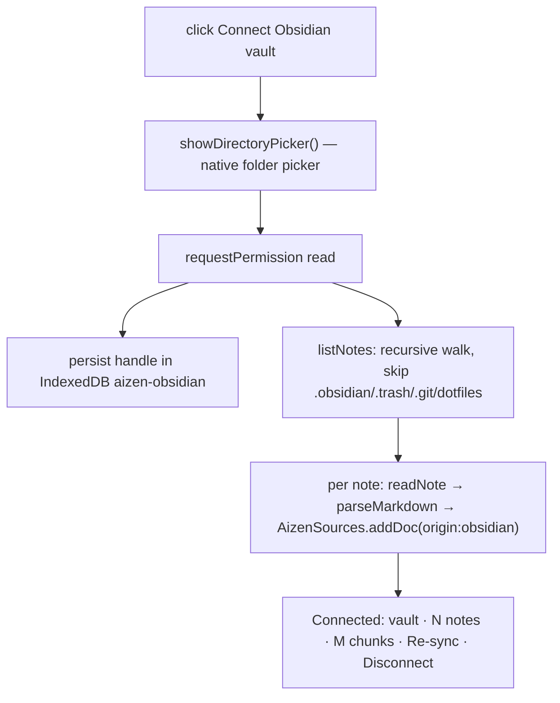

# Feature F4 — Connect Your Obsidian Vault

> [!abstract] Your notes ground the AI
> Connect a whole **Obsidian vault** — a folder of markdown notes — and Aizen uses the
> relevant notes to ground its explanations and answers, citing each as a read-only
> **`🔮 <note path>`** chip. There is **no Obsidian plugin, no server-side filesystem
> access, and no Obsidian login** — it's a thin, **client-side, browser-only** reader.

- **Connector:** `packages/server/public/obsidian.js` (`window.AizenObsidian`).
- **UI:** `connectObsidian` / `indexObsidian` / `resyncObsidian` / `tryRestoreObsidian` in
  [[The Browser Client|client.js]].
- **Grounding:** notes go through [[S0 - Source Library and Retrieval|S0]] (`origin:'obsidian'`).
- **Reference:** the in-repo deep-dive is `docs/OBSIDIAN_INTEGRATION.md`.

> [!tip] This vault you're reading was made *for* this feature
> The whole reason these Obsidian-formatted notes exist is so a vault like this can be
> dropped into Obsidian and, in turn, connected back into Aizen as a grounding source.

---

## A vault is just a folder of markdown

So the integration is a thin reader behind a **provider seam** (the same BD-03 pattern as
`WebSearchProvider`). One interface, four implementations chosen by environment:

```js
interface ObsidianProvider {
  connect(): Promise<{ vaultName }>;
  listNotes(): Promise<Array<{ path }>>;
  readNote(path): Promise<string>;       // raw markdown, READ-ONLY
  status(): 'connected' | 'disconnected' | 'unsupported';
}
```

| Provider | When | Backed by | Reconnect? |
|---|---|---|---|
| **FileSystem** | Chromium desktop (zero-install) | File System Access API `showDirectoryPicker()` | ✅ handle persisted in IndexedDB |
| **Upload** | Firefox / Safari / no FS-Access | `<input webkitdirectory>` FileList | ❌ re-pick each session |
| **RestApi** | *Phase-2 stub* — Obsidian Local REST API plugin | `fetch` to `127.0.0.1:27124` | n/a — not fully wired |
| **Null** | unsupported browser | nothing | UI degrades to upload |

Because call sites never branch on provider type, the connect/index/resync code is
identical regardless of which path the browser took.

---

## How it connects (the common Chromium path)



- `parseMarkdown` strips a leading YAML frontmatter block, keeps headings/body; `[[wikilinks]]`
  are kept as plain tokens (not resolved).
- Ignored: `.obsidian/` (config), `.trash/` (deleted), `.git/`, and all dotfiles/dotdirs.
- Capped at ~4,000 notes (UI) / 5,000 (provider) to bound a pathological vault.
- **Re-sync** = `removeByOrigin('obsidian')` then re-index (there's no live file-watching —
  edits are picked up by re-sync). **Disconnect** drops the provider + deletes the handle.
- **Reconnect on return** — `tryRestoreObsidian` restores the IndexedDB handle and offers
  one-click re-grant; the **upload** fallback can't persist a handle, so it re-picks.

---

## How a note grounds an answer

Notes are not dumped wholesale. Each is chunked by [[S0 - Source Library and Retrieval|S0]],
and only the **top-k chunks** lexically matching the current sentence/question are sent as
`user_sources`. The [[The Server|server]] keeps `origin:'obsidian'`, the
[[The Intelligence Engine|engine]] folds them in as authoritative context and emits
`type:'obsidian'` citations, and the [[The Browser Client|client]] renders the `🔮 note
path` chip (read-only, no link).

> [!tip] Works with no Tavily key
> Because user sources are independent grounding, a question can be answered **purely from
> the vault** even with web search disabled — the answer fires whenever there's *any*
> grounding (web **or** user). See [[F2 - Sentence Explanation and BYO Sources]].

---

## Privacy & portability

> [!success] Privacy by design
> **Read-only, always** — no provider ever writes to the vault. Note text stays in the
> browser, in memory, for the session. Only the S0-selected chunks leave, only with a
> request; raw note text is never logged. Server-side persistence is **opt-in only**
> (`StoredSource origin:'obsidian'`, byte-quota-gated — [[The Account System]]).

| Environment | Connect path | Reconnect? |
|---|---|---|
| Chrome / Edge / Brave / Opera / Arc (desktop) | native picker — **one click, zero install** | ✅ |
| Firefox / Safari (desktop) | `webkitdirectory` folder upload | ❌ re-pick |
| Mobile | usually upload fallback | ❌ partial |

Hard requirements: the vault is **local to that machine**, a **modern browser**, and a
**secure context** (`https://` or `localhost` — the FS Access API requires it). No
Obsidian login, plugin, or key.

---

## Intentionally out of scope (Phase 1)
No live file-watching, no write-back/two-way sync, no Dataview/canvas/plugin rendering,
no non-markdown attachments, `[[wikilinks]]` left as plain tokens, no semantic retrieval
(lexical BM25 only), REST-plugin path stubbed.

---

## Related
- [[S0 - Source Library and Retrieval]] — chunking + BM25 over note text
- [[F3 - Local File Sources]] — same machinery for individual files
- [[F2 - Sentence Explanation and BYO Sources]] — how vault notes ground answers (🔮 chips)
- [[The Account System]] — opt-in `StoredSource` persistence
- [[Consent and Privacy]] — read-only, bounded, never-logged posture
