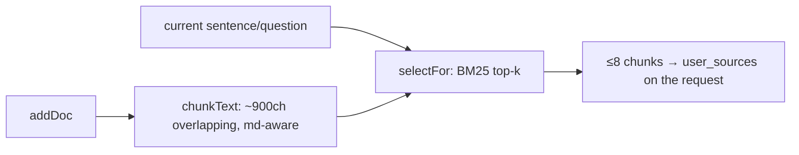

# S0 — The Source Library & Top-k Retrieval

> [!abstract] The shared building block under BYO sources
> A self-contained, **client-side, in-browser** library that chunks your sources and, per
> question, returns only the **top-k relevant chunks**. It's the shared foundation under
> [[F2 - Sentence Explanation and BYO Sources|pasted notes]],
> [[F3 - Local File Sources|local files]], and the
> [[F4 - Obsidian Vault Connection|Obsidian vault]]. Without it, connecting a 2,000-note
> vault would mean shipping the whole thing on every request; with it, only a few matching
> chunks go.

- **File:** `packages/server/public/sources.js` (~453 lines), exposes `window.AizenSources`.
- **Loaded first** (before `obsidian.js` and `client.js`) so the rewired BYO path can use it.
- **Spec:** "S0" in `New_Feature.md` — the "build first" infrastructure for F3/F4.

---

## The public API

```js
AizenSources = {
  addDoc(input),          // chunk + index a source { id, origin, title?, path?, url?, text }
  removeDoc(id), removeByOrigin(origin), getDoc(id), listDocs(), clear(),
  selectFor(queryText, opts),   // → UserSource[]  (the retrieval call)
  stats(), LIMITS, _internals:{ tokenize, chunkText, utf8Len }
}
```

A doc holds `{ id, origin:'paste'|'file'|'obsidian', title?, url?, path?, text,
chunks:[{text, idx}], bytes, addedAt }`. `addDoc` **de-dupes** by `(origin, path)` (or
`(origin, title)` for non-paste; pastes never de-dupe), so a re-sync **replaces** a note
rather than duplicating it.

---

## Markdown-aware chunking (`chunkText`)

Sources are split into overlapping, heading-aware chunks:

- `splitParagraphs` splits on blank lines and headings (`^\s{0,3}#{1,6}\s+\S`).
- A heading **starts a new chunk** and is **re-seeded** into continuation chunks (so a
  chunk always knows which section it's from).
- `overlapTail` carries trailing characters across boundaries so context isn't lost at a
  cut.
- An oversized single paragraph is hard-split into target-size slices.

| Bound | Value |
|---|---|
| `CHUNK_TARGET` / `CHUNK_MAX` | ~900 / ~1,100 chars |
| `CHUNK_OVERLAP` | 160 chars |
| `MAX_CHUNKS_PER_DOC` | 400 |
| `LIBRARY_MAX_BYTES` | 32 MB total extracted text (fail-closed — returns `null`, no eviction) |

---

## The retrieval algorithm (`selectFor`) — classic BM25

```js
selectFor(queryText, { maxChunks = 6, maxCharsPerChunk = 600 }) → UserSource[]
```

1. **Tokenize** the query: lowercased alphanumeric, stop-word filtered, length 2–32
   (per-chunk term frequencies are memoized in `chunk._tf` / `_len`).
2. **Score** each chunk with **BM25** (`k1 = 1.5`, `b = 0.75`):
   `idf = log(1 + (N − df + 0.5)/(df + 0.5))`, length-normalized by the average chunk
   length `avgdl`.
3. **Sort** by **score desc → doc recency (`seq`) desc → chunk idx asc**. A zero-score /
   empty-query case degrades to "most recent first" — byte-for-byte the pre-S0 paste
   behavior.
4. **Cap** by `maxChunks` *and* a global byte budget — a too-big chunk is skipped while
   smaller ones keep filling. Each result is shaped as
   `{ id:'us_<docId>_<chunkIdx>', text, origin, title?, url? }`.

> [!info] The grounding budget (per request)
> `GLOBAL_MAX_CHUNKS = 12`, `GLOBAL_MAX_BYTES = 24 KB`. The
> [[The Browser Client|client]] requests `{ maxChunks: 8, maxCharsPerChunk: 600 }` per
> sentence; the [[The Server|server]] then re-bounds it (`coerceUserSources`: ≤ 40 items,
> ≤ 64 KB aggregate). A giant vault can't exhaust memory or the prompt.



---

## Why BM25 (and what's deferred)

> [!note] Lexical now, semantic later
> S0 is **lexical BM25-lite only** — no embeddings, runs entirely in the browser, no
> server round-trip to retrieve. A server-side hybrid (embeddings + BM25, the blueprint's
> team-05 target) is a separate, later effort. `removeByOrigin('obsidian')` is how a vault
> re-sync clears and re-indexes ([[F4 - Obsidian Vault Connection]]).

---

## Related
- [[F2 - Sentence Explanation and BYO Sources]] — what consumes `selectFor`'s output
- [[F3 - Local File Sources]] · [[F4 - Obsidian Vault Connection]] — the producers feeding `addDoc`
- [[The Browser Client]] — `userSourcesForSend` wires this into each request
- [[The Server]] — `coerceUserSources` re-bounds the result
