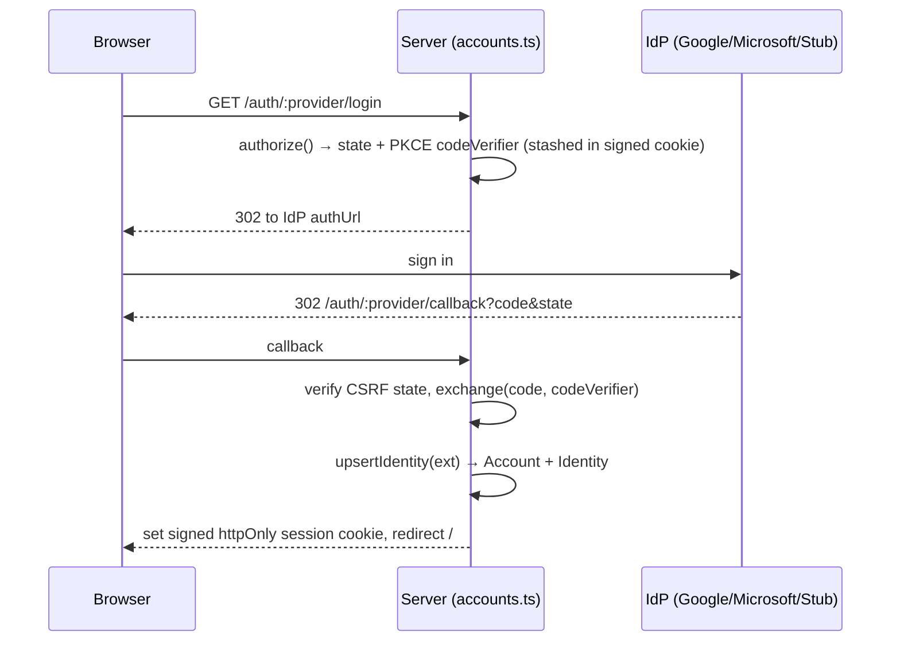

# The Account System (`@aizen/accounts`)

> [!abstract] A first-class account layer, added *around* the pipeline
> Sign in with OAuth → get a persistent **account** with a **tier-gated resource quota**.
> It's layered around the existing mic→STT→intel flow **without changing it** (the
> anonymous demo flow is unchanged if you never sign in). Everything is **key-gated**
> (BD-03): with no OAuth keys, the only sign-in offered is a deterministic **Stub** demo
> account, so the feature works locally with no identity provider.

- **Package:** `@aizen/accounts`; server glue in `packages/server/src/accounts.ts`.
- **Contracts:** `Account`, `Identity`, `Entitlement`, `SavedSession`, `StoredSource`,
  `StoredArtifact`, `QuotaStatus`, `QuotaError` (`@aizen/contracts/src/account.ts`).

---

## The four pieces (from `index.ts`)

| Piece | What it does |
|---|---|
| **AuthProvider seam** | `Stub` (no keys, demoable) + `OAuthProvider` for **Google / Microsoft Entra** (Authorization-Code + **PKCE**) |
| **AccountRepository** | swappable store: `InMemory` + `node:sqlite` + **PostgreSQL** (the Azure Phase-1+ target) |
| **Entitlements / quota** | per-tier caps (resources, source bytes, retention, model tier); **hard-reject** over cap |
| **CookieSigner** | signed, httpOnly server-side **session cookies** |
| **AccountService** | the one business-logic surface the server calls |

---

## Sign-in: OAuth + PKCE behind a seam



`upsertIdentity` maps a federated `(provider, subject)` onto an account: it reuses the
existing account when the link is known, else mints a new **Free** account + identity on
first sign-in (refreshing email/name from the IdP each time). One account can link several
identities (same person via Google *and* Microsoft).

> [!note] Cookie secret
> `SESSION_COOKIE_SECRET` signs the session cookie; absent ⇒ an ephemeral per-process
> secret (logins survive reloads but not a restart). Set it (ideally from Azure Key Vault)
> to persist logins and share one secret across replicas.

---

## Tiers, entitlements & quota

Per-tier caps are **seeded** in `entitlements.ts` (from the team-10 packaging + cost
tables) and read through the single point `entitlementFor` so no cap is hard-coded at a
call site:

| Tier | Saved sessions | Stored source bytes | Retention | Model cap |
|---|---|---|---|---|
| **Free** | 5 | 2 MB | 7 days | **haiku-only** |
| **Pro** | 200 | 100 MB | ~12 months | opus |
| **Team** | 1,000 (pooled) | 1 GB | 12 months | opus |
| **Enterprise** | configurable (null) | configurable | configurable | opus |

The `model_tier_cap` feeds [[The LLM Gateway|clampTier]] (Free → Haiku). Quota is enforced
**fail-closed** in `AccountService`:

```ts
// saveResource: new resource → check the cap BEFORE creating anything
if (!already) { if (!checkQuota(tier, used, max_resources).ok) throw QuotaExceededError; }
// saveSource: byte quota; re-save counts only the delta (existing bytes excluded)
const baseline = existing ? usedBytes - existing.bytes : usedBytes;
if (!checkSourceQuota(tier, baseline, bytes, max_source_bytes).ok) throw SourceQuotaExceededError;
```

An over-cap create is rejected with a **typed, user-legible** `QuotaError` (a **409**)
carrying `{ tier, used, limit, message, remedy }` — "upgrade, or delete a saved session."

> [!important] Quota is a ceiling, retention still expires
> A saved resource carries the live session's `consent_class`/`pii_present` **forward** and
> gets an `expires_at_us` from the tier's retention window. The cap bounds the *concurrent*
> count; data still expires. The account layer **adds to, never relaxes**, the team-09
> posture — see [[Consent and Privacy]].

---

## The swappable repository (fail-open store selection)

`buildAccountSystem` picks a backend so the app **always boots**:

1. **PostgreSQL** when `DATABASE_URL` is set and reachable (the Azure target; TLS via
   `sslmode=require`).
2. else **SQLite** (`node:sqlite`, no native build — default `.data/accounts.db`).
3. else **in-memory**.

A `migrate-sqlite-to-postgres.ts` script moves data when you graduate to Postgres. Note
`USE_LOCAL_DB` forces SQLite even if `DATABASE_URL` is set — the "secrets in Key Vault,
database on your laptop" mode (see [[Running and Configuring]]).

---

## The account HTTP routes (server-side, `accounts.ts`)

| Route | Purpose |
|---|---|
| `GET /api/session` | who am I + tier + quota + sign-in menu + provider status + plan table |
| `GET /auth/:provider/login` · `/callback` · `POST /auth/logout` | the OAuth round-trip |
| `GET/POST /api/sessions`, `GET/DELETE /api/sessions/:id` | saved-session CRUD (a saved resource = session + its artifacts) |
| `GET/POST /api/sources`, `GET/DELETE /api/sources/:id` | stored-source CRUD ([[F3 - Local File Sources]] Phase B) |

> [!note] Ownership falls out for free (team-09 T6)
> The repository is **account-scoped**, so `getResource`/`deleteSource`/etc. already return
> null/false for another account's id — a 404 falls out naturally with no extra ownership
> check. Save consent is **upgrade-only** (a client may raise a save to `'sensitive'`,
> never lower it).

---

## Related
- [[The Server]] — `handleAccountRequest` wires these routes around the pipeline
- [[The Browser Client]] — the sign-in menu, quota bar, and saved-session history UI
- [[The LLM Gateway]] — consumes the per-tier `model_tier_cap`
- [[Consent and Privacy]] — consent carried forward into saved resources
- [[F3 - Local File Sources]] · [[F4 - Obsidian Vault Connection]] — what `StoredSource` persists
