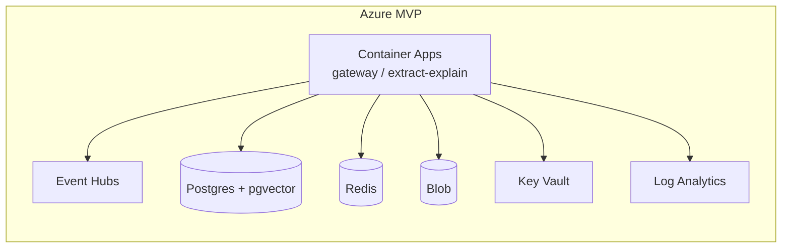

# Deployment & Testing

Covers how Aizen is meant to run in production (Azure + Docker), and how it's verified
(tests + toolchain). The platform is **F04** — see [[Consent and Privacy]] for the trust
half.

---

## Docker

A single image runs the TypeScript app **directly via `tsx`** — no compile step at
runtime.

```dockerfile
FROM node:22-bookworm-slim
RUN corepack enable
COPY package.json pnpm-lock.yaml pnpm-workspace.yaml ./ ; COPY packages ./packages
RUN pnpm install --frozen-lockfile
COPY . .
ENV NODE_ENV=production  PORT=5173
CMD ["pnpm", "start"]          # = tsx packages/server/src/index.ts
```

`.dockerignore` keeps `node_modules`, `.git`, `.data`, and `.env` out of the image. The
image is built by `infra/azure-deploy-app.ps1` via `az acr build`.

---

## Azure infrastructure (Terraform skeleton)

> [!warning] Status: skeleton, no live deploy
> `terraform plan/apply` will **not** run until an Azure subscription + credentials exist
> — the hard external gate **MAN-F04-001**. The skeleton lets the platform shape, sizing,
> and decisions live in code now.

The MVP topology (D02 ≈ 200 concurrent, single region `eastus`, zone-redundant) as
Terraform modules:

```
infra/modules/
  network        VNet, public/app/data subnets, NAT + private endpoints
  eventbus       Event Hubs namespace + hub, per-session partition key   (D13)
  datastores     PostgreSQL Flexible Server + pgvector, Redis, Blob, Cosmos DB, Key Vault (D14)
  compute        Container Apps environment + service skeletons (gateway / extract-explain)
  observability  Log Analytics + metric namespace (cost/SLO dashboards = P0)
```

| Decision encoded | Where |
|---|---|
| **D13** EventBus = Event Hubs @ MVP → Kafka-compatible log @ Year-1 | `modules/eventbus` |
| **D14** Postgres+pgvector, Redis, Blob, +Cosmos (idempotency/audit) | `modules/datastores` |
| **D03** single region eastus, zone-redundant | `variables.tf` |
| **D-PLAT-01** hot path = Container Apps (no Functions on hot path; GPU=AKS deferred) | `modules/compute` |
| **D10 / D18** no-audio-retention default; audio container expires | `modules/datastores` |

Deferred until the doc-04 scaling triggers fire: a Kafka-compatible log, AKS + GPU pools
(self-host STT/LLM), a graph DB, a dedicated vector DB, DDoS Standard, second region / EU
residency. Run order once MAN-F04-001 lands: `az login → terraform init → plan → apply
-var-file=env/mvp.tfvars` (a `dev-cheap.tfvars` exists too). Helper scripts:
`infra/azure-setup.ps1`, `infra/azure-deploy-app.ps1`,
`scripts/start-local-azure-secrets.ps1`.



---

## Testing (~170 Vitest tests)

Tests are **executable specifications** — they encode the validation-pass fixes (H-7/H-8/
H-9/H-13) as regression guards. Coverage spans the whole stack:

| Area | Examples |
|---|---|
| Contracts | `contracts.test.ts` — every schema + the golden fixtures |
| Seams | adapter (rev/supersedes carried), supersede propagation, KG resync |
| Gateway | tier routing, cost ceilings, Anthropic provider (injected client) |
| STT | stub lifecycle, Deepgram provider (injected), diarization, DER harness |
| Intel | explain, enrich, follow-up |
| Accounts | OAuth/PKCE, repository (in-memory + SQLite), quota, account routes |
| Client UI | `client.test.ts` against a **headless DOM harness** (`dom-harness.ts`, no layout engine) + `sources.test.ts` |

```bash
corepack pnpm@9.7.0 test         # all tests
corepack pnpm@9.7.0 typecheck    # tsc -b across the monorepo
corepack pnpm@9.7.0 spine        # run the deterministic stub spine
corepack pnpm@9.7.0 --filter @aizen/contracts run export-schema   # regenerate the registry
```

> [!info] The contract-test philosophy
> A passing test is only as good as its fixture — the [[How It Was Built - ClaudeTrees|H-7
> bug]] *passed its own tests* because the fixture dodged the problem. The lesson is baked
> into the suites: the seam tests now assert the previously-dropped fields survive, and the
> contracts are the single authoritative shape both sides validate against
> ([[Data Contracts]]).

---

## Toolchain quirks (this machine)

> [!warning] Node 24.6 + jitless workaround
> On the dev machine, Node 24.6's V8 crashes on real compiles. The workaround used here:
> `node --jitless …/tsc.js -p` for type-checking and `tsx --jitless` to run. **Vitest
> can't run in that environment** — verification falls back to `tsx`/`vm` smokes and a live
> SQLite server. (`pnpm` is also not on PATH, hence `corepack pnpm` everywhere and
> `run.ps1` — see [[Running and Configuring]].)

Monorepo basics: **pnpm workspaces** (`pnpm-workspace.yaml`), **TypeScript project
references** (`tsconfig.json` `-b`), `tsx` to run TS without a build, **Vitest** for tests.
`engines.node >= 20`; `packageManager: pnpm@9.7.0`.

---

## Related
- [[Running and Configuring]] — local run + the `.env` keys
- [[The Account System]] — the Postgres/SQLite store these provision
- [[The Event Bus]] — the in-process stand-in for the Event Hubs backbone
- [[Architecture Decisions|D13 / D14 / MAN-F04-001]]
