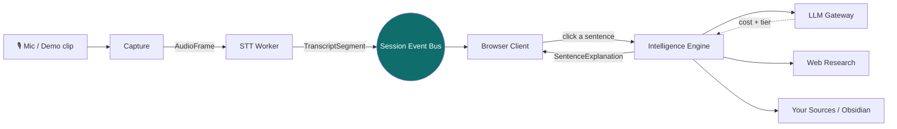

# 🧠 Aizen — Project Knowledge Vault

> [!abstract] What this vault is
> A complete, navigable explanation of the **Aizen / ConversationAgent** project —
> what it is, how it was designed and built, and how every part of the running code
> works. Drop this folder into Obsidian and use the graph view to explore.
>
> **Aizen** is a *real-time conversation-intelligence copilot*: it listens to a live
> conversation and **explains and teaches** everything being said — transcript,
> meanings, jargon, sourced answers — as it happens. Tagline: *"AI explains the room."*

---

## 🗺️ Start here

- [[What Is Aizen]] — the product, the vision, the headline numbers, the run modes.
- [[System Architecture]] — the five lanes, the pipeline, and the package map.
- [[How It Was Built - ClaudeTrees]] — the multi-agent process that produced this repo.
- [[Glossary]] — every acronym, decision ID, and term in one place.

## 🧩 The big picture

Everything rides **one per-session ordered event stream** (the [[The Event Bus|event bus]])
and is glued together by a handful of versioned [[Data Contracts]]. See
[[System Architecture]] for the full walk-through.

---

## 📚 Map of contents

### Overview & concepts
- [[What Is Aizen]]
- [[System Architecture]]
- [[Glossary]]

### How it was designed & built
- [[How It Was Built - ClaudeTrees]]
- [[Architecture Decisions]]
- [[The Blueprint Documents]]

### Runtime core (the pipeline)
- [[The Event Bus]] — the per-session ordered backbone
- [[Data Contracts]] — the canonical shapes every lane shares
- [[Audio Capture and STT]] — mic → AudioFrame → TranscriptSegment (+ diarization)
- [[The LLM Gateway]] — model tier routing & cost ceilings
- [[The Intelligence Engine]] — explain, extract, answer, ground (incl. web research)
- [[Consent and Privacy]] — the fail-closed privacy model
- [[Correction Seams]] — adapter, supersede, resync

### The application
- [[The Server]] — HTTP + WebSocket, the live session wiring
- [[The Browser Client]] — the single-file dashboard UI

### Features
- [[F1 - Follow-up Answers]]
- [[F2 - Sentence Explanation and BYO Sources]]
- [[S0 - Source Library and Retrieval]]
- [[F3 - Local File Sources]]
- [[F4 - Obsidian Vault Connection]]
- [[Document Picture-in-Picture]]
- [[The Account System]]

### Operations
- [[Running and Configuring]]
- [[Deployment and Testing]]
- [[UI Redesign]]

---

## ⚙️ Project facts at a glance

| | |
|---|---|
| **Repo** | `T:\ConversationAgent` (monorepo, pnpm + TypeScript) |
| **App entry** | `pnpm start` → `tsx packages/server/src/index.ts` → http://localhost:5173 |
| **Packages** | 14 (`@aizen/*`) — see [[System Architecture]] |
| **Runs without keys** | Yes — a deterministic **demo** mode; real providers swap in by key presence |
| **Real providers** | Anthropic (LLM), Deepgram (STT), Tavily (web search), Google/Microsoft (OAuth) |
| **Tests** | ~170 (Vitest) — contracts, seams, gateway, STT, accounts, client UI |
| **Cloud target** | Azure (Terraform skeleton; no live deploy yet) |
| **Status** | Phase-0 spine + several shipped features; vendor-gated work remains |

> [!tip] How to read this vault
> The notes are **atomic and cross-linked**. Follow `[[wikilinks]]` rather than reading
> top-to-bottom. Decision IDs like **D16**, **BD-03**, **INV-8** recur everywhere — the
> [[Architecture Decisions]] note and the [[Glossary]] decode them.
